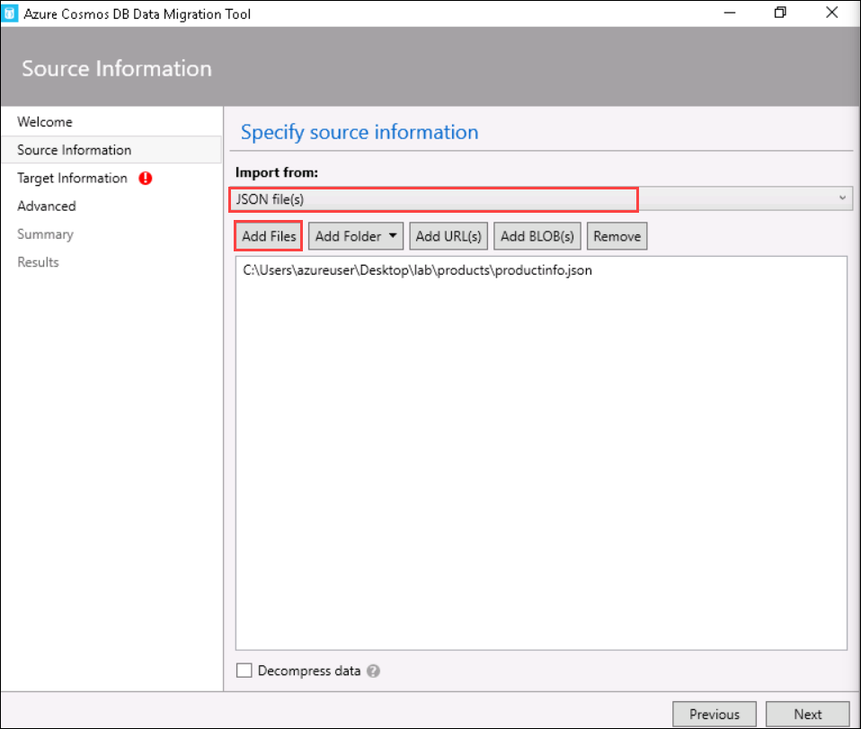
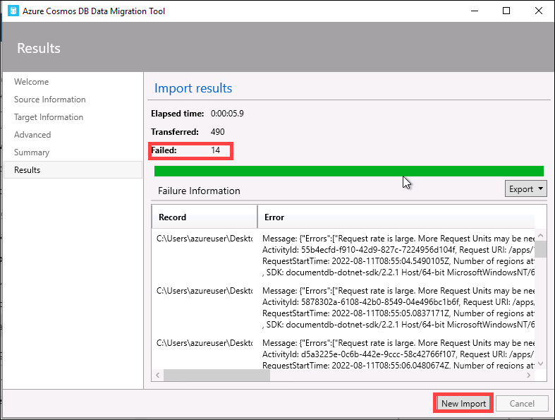
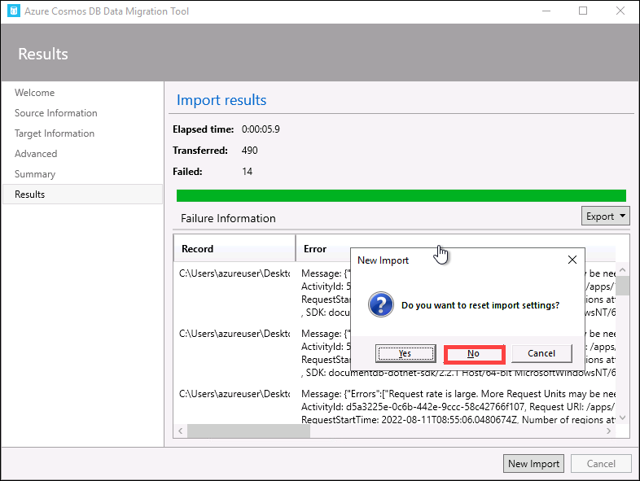
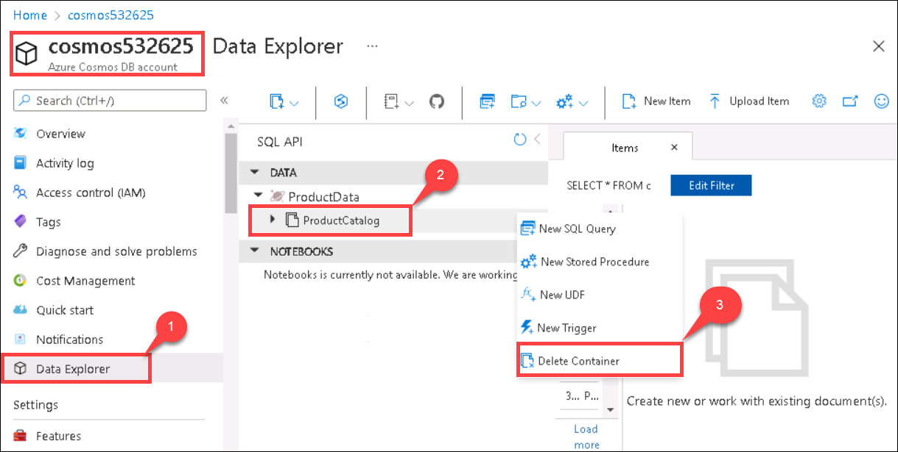

# Manage Azure Cosmos DB

In this exercise, you'll review how Cosmos DB stores data. Then you'll learn how to upload data to a Cosmos DB database, and configure Cosmos DB to support bulk loading.


## Task 1: Load data using the Cosmos DB Data Migration tool

1.  Sign in to the [Azure portal](https://portal.azure.com/learn.docs.microsoft.com) using the credentials provided in the Environment details page from the left side.

2.  On the home page, select **Azure Cosmos DB**.

    

3.  On the Azure Cosmos DB page, select the Cosmos DB account with name cosmos{deploymentID} present in the page.

    

4.  On the Cosmos DB account page, under Settings, select **Keys**. Copy the **PRIMARY CONNECTION STRING** to the clipboard.

    


6.  Open up a **Command prompt** by clicking the **Start button**, typing Command Prompt, right clicking Command prompt, and selecting **Run as administrator** in the right-click menu. Navigate to desktop using the cd command, and then run the second command to create another copy of the code and data required for the exercise.

      >**Note**: You need a copy of the data on your computer because you'll run the tools to upload this data from your desktop.

    ``` 
        cd desktop
        
        git clone https://github.com/MicrosoftDocs/mslearn-explore-non-relational-data-stores-azure.git lab

     ```

    
    
7.  On the desktop, Double-click the file **dtui.exe**. This application is the Data Migration Tool.

    

8.  On the Welcome page of the Data Migration Tool, select **Next**.

    

9. On the Source Information page, in the Import from drop-down list box, select **JSON file(s)** and then select **Add Files**.

    

10. In the Open dialog box, browse to the folder on the desktop where you cloned the repository containing the sample data for the exercise, move to the lab folder, move to the products folder, and select the **productinfo.json file**. Select **Open**.

    >**Note:** The productinfo.json file contains the product information in JSON format. If you have time, you can examine the contents of this file using Notepad.
   
    
11. Back on the Source Information page, select **Next**.

12. On the Target Information page, enter the following settings, and then select **Next**.

    TABLE 1
    | Field | Value |
    | --- | --- |
    | Export to | Azure Cosmos DB - Sequential record import (partitioned collection) |
    | Connection String | Paste the primary connection string from the clipboard, and append the text **database=ProductData** to the end of the string, after the semi-colon ( ; ) character. |
    | Collection | ProductCatalog |
    | Partition Key | /productcategory/subcategory |
    | Collection Throughput | 1000 |
    | ID | *leave empty* |

    

13. On the Advanced page, leave all settings at their default values, and then select **Next**.

    

14. On the Summary page, select **Import**.

    

15. Wait while the import proceeds. It should complete without any errors or warnings, and report that it has transferred 504 records.

    
    
16. If you find the import failed with error message. Keep a note of the **Failed** json files. Now we will try to perform the import again. 

    

17. Select **New Import** option at the bottom, and on the pop up asking **"Do you want to reset the import settings?"**, select **No**. 

    

18. Leave all settings at their default values, and then select **Next** until you are back on the summary page. Select **Import**.

19. Note that the earlier failed files have been successfully imported and the files which were already imported return an error message.

20. Close the Data Migration Tool.

      >**Note** : If you find the import failed with error message even after the above steps, Navigate to your Azure Cosmos DB account, select data explorer and delete the "ProductCatalog" container as shown below. Then perform the steps from 9 to 17 again.

    


