# Provision Azure relational database services

As part of your role at Contoso as a data engineer, you've been asked to create and configure SQL Server, PostgreSQL, and MySQL servers for Azure.

Select a region from the following list when you create resources:

-   West US 2
-   South Central US
-   Central US
-   East US
-   West Europe
-   Southeast Asia
-   Japan East
-   Brazil South
-   Australia Southeast
-   Central India

## Task 1: Create your Azure SQL Database service

In this task you'll set up your Azure SQL Database instance, which includes creating your server.

Over time if you realize you need additional compute power to keep up with demand, you can adjust performance options or even switch between the DTU and vCore performance models.

1.  Open **Edge Browser** and log in to the **Azure portal**. When prompted, use the credentials provided within the **Environment Details** tab of the lab guide.

    
    

    >**NOTE**- The DeploymentID can be obtained from the Lab Environment output page.

2.  In the portal, select **Create a resource** from the upper left-hand corner. Select **Databases**, then select **SQL Database**.

    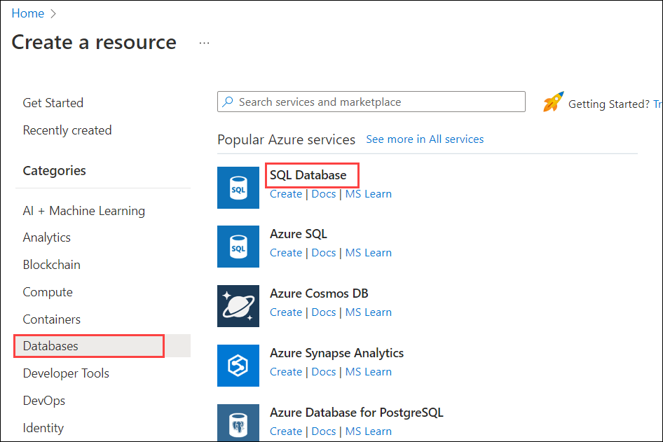

3.  Enter the following values into the form:

    | Setting | Value  |
    | --- | --- |
    | Subscription | **Default Subscription** |
    | Resource group | **DP900-DID** |
    | Database name | **ContosoDID**, where **DID** is the DeploymentID can be obtained from the Lab Environment output page. |
    | Want to use SQL elastic pool? | **No** |

4.  Under Server, select **Create new**, fill out the Create SQL Database Server form with the following values, and then select **OK**:

    | Setting | Value  |
    | --- | --- |
    | Server name | **sqlDID**, where **DID** is the DeploymentID can be obtained from the Lab Environment output page.|
    | Authentication method | click on **Use SQL authentication** |
    | Server admin login | **azureadmin** |
    | Password | **Pa55w.rd** |
    | Confirm password | **Pa55w.rd** |
    | Location | **Select the default location** |

    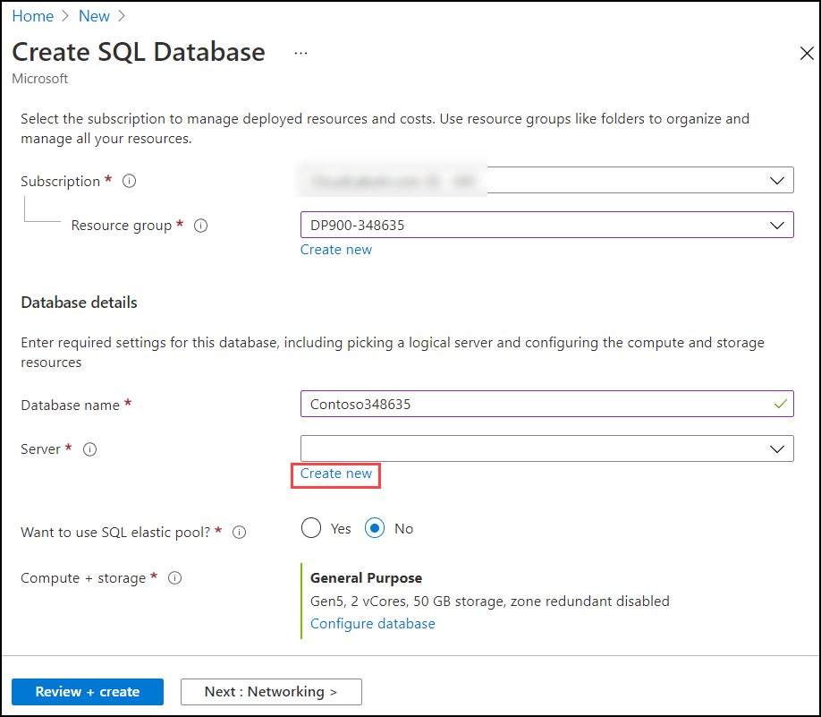
    
    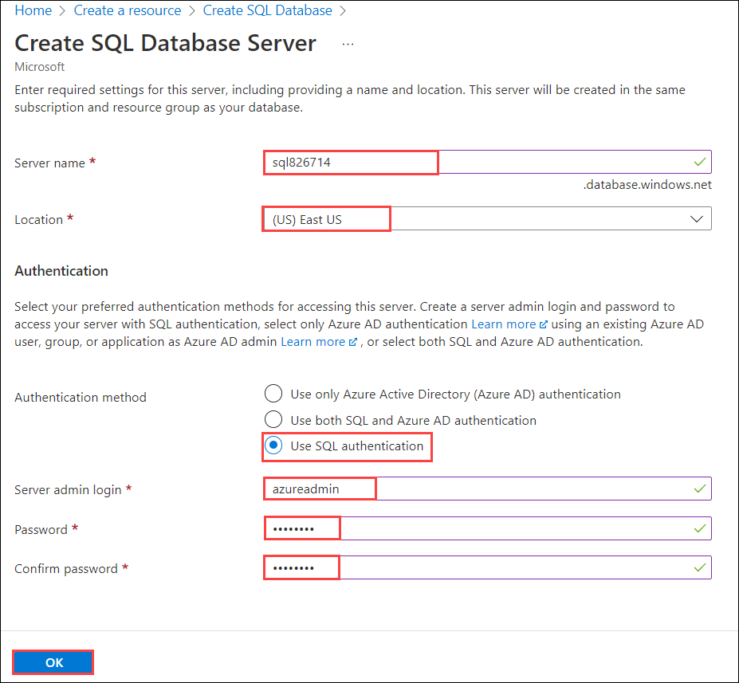

5.  Under **Compute + storage**, select **Configure database**.

6.  On the Configure page, leave vCores set to **2**, change Data max size to **50 GB**, and then select **Apply**.

    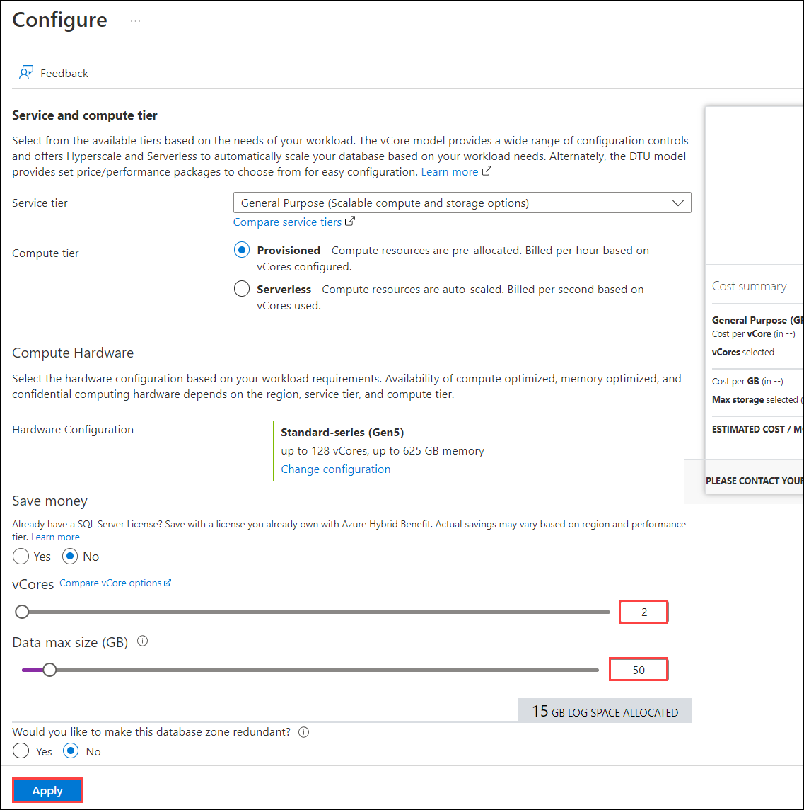

7.  Back on the Create SQL Database page, select **Additional settings** tab from top header.

8.  Use these values to fill out the form.

    | Setting | Value  |
    | --- | --- |
    | Use existing data | **None** |
    | Database Collation | **SQL_Latin1_General_CP1_CI_AS** |
    | Maintenance window | **Default** |

    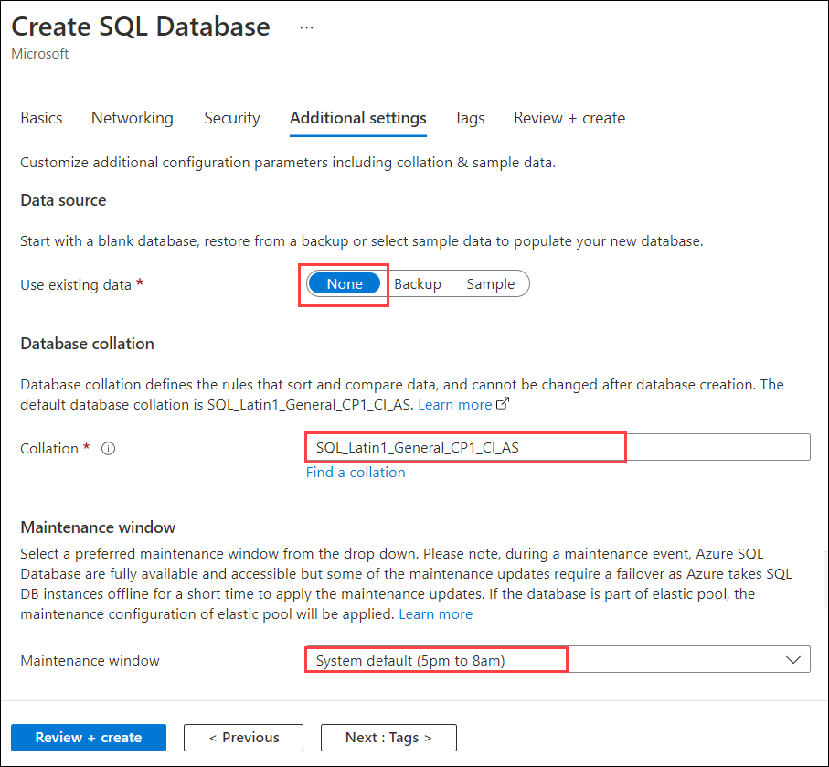

9.  Select **Review + Create**, and then select **Create** to create your Azure SQL database.  

## Task 2: Create your Azure Database for PostgreSQL service (Optional)

In this exercise, you'll set up Azure Database for PostgreSQL

1.  On the Azure portal, select **Create a resource** from the upper left-hand corner.

2.  Select **Databases**, then select **Azure Database for PostgreSQL**.

    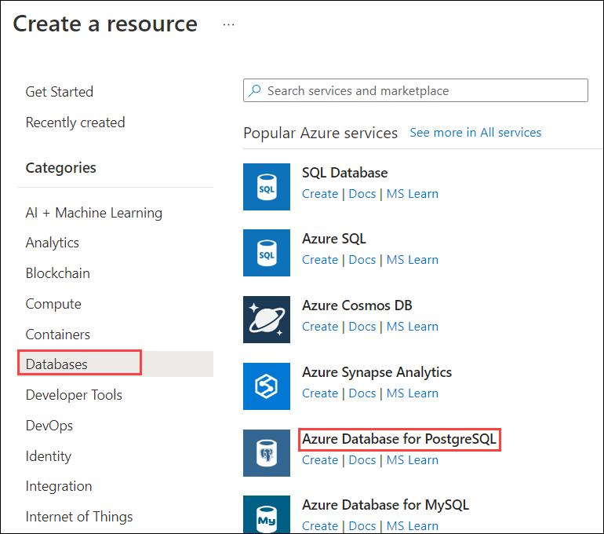

3.  On **Select Azure Database for PostgreSQL deployment option** page, Select **Single Server** from the drop-down menu and then click on **Create**.

    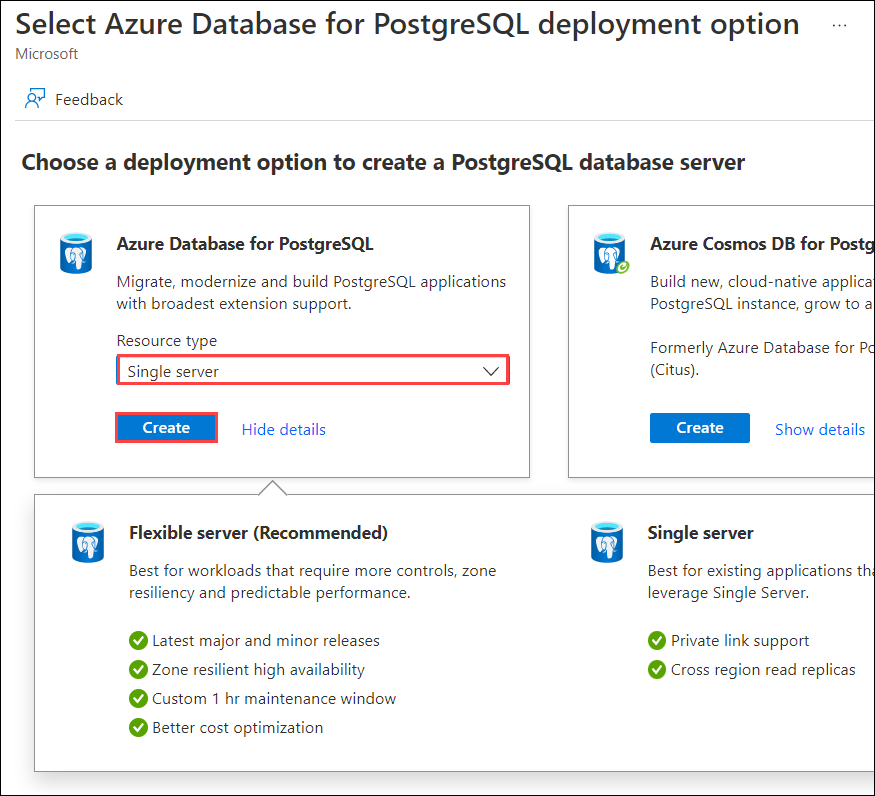
    
4. If prompted with pop-up of **Consider creating flexible server**, Select **No - Create single server**.

5.  Use these values to start filling out the form.

    | Setting | Value  |
    | --- | --- |
    | Subscription | **Default Subscription** |
    | Resource group | **DP900-DID** |
    
6.  Under Server details, use these values:

    | Setting | Value  |
    | --- | --- |
    | Server name | Enter **postgresqlDID**, where **DID** is the DeploymentID can be obtained from the Lab Environment output page.|
    | Data source | **None** |
    | Location | **Select the default location** |
    | Version | **Keep default setting** |

    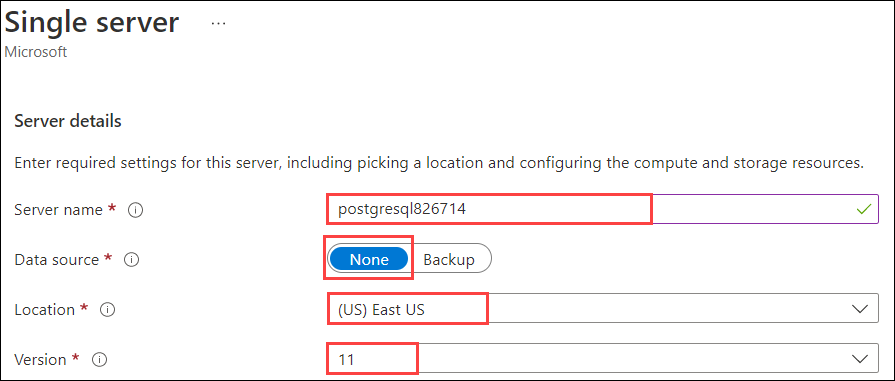

7.  Under **Compute + storage**, select **Configure server**.

    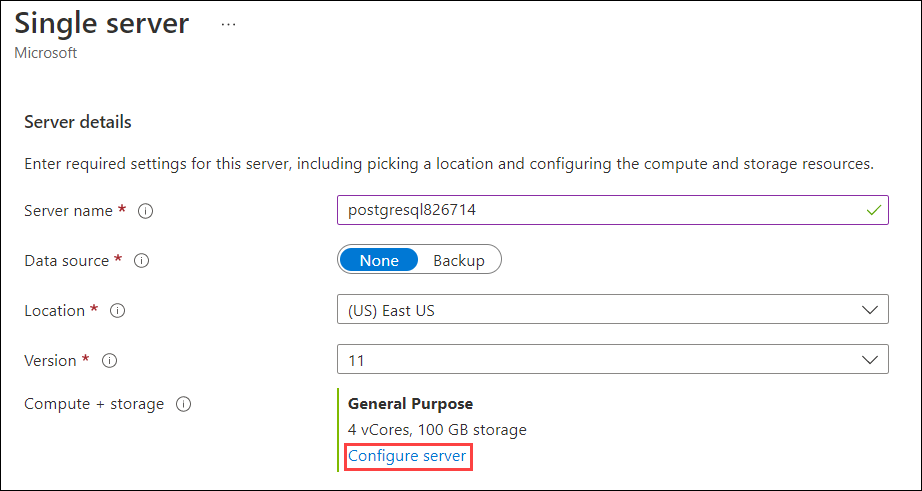
 
8.  Change **vCore** to **two cores**, increase the **storage** to **160 GB**, set the Backup Retention Period to **14 days**, and then select **OK**.
    
    

9.  Back on the Single server page, under Administrator account, specify these values:

    | Setting | Value  |
    | --- | --- |
    | Admin username | **azureadmin** |
    | Password | **Pa55w.rd** |
    | Confirm password | **Pa55w.rd** |
    
    
    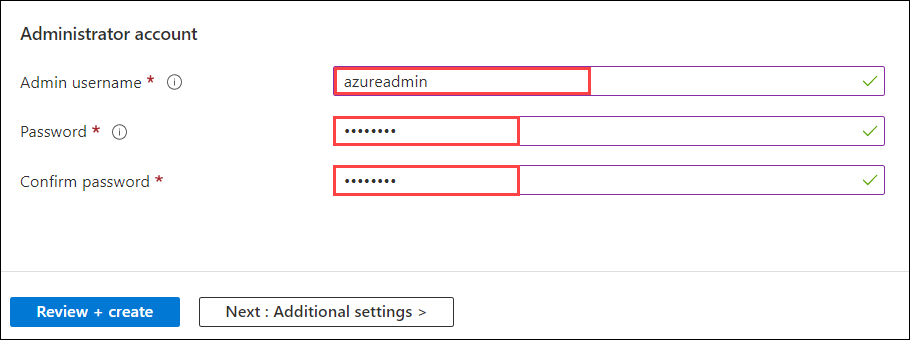

10.  Select **Review + Create**, and then select **Create** to create your Azure PostgreSQL database.

## Task 3: Create your Azure Database for MySQL service (Optional)

In this exercise you'll set up Azure Database for MySQL

1.  On the Azure portal, select **Create a resource** from the upper left-hand corner.

2.  Select **Databases**, then select **Azure Database for MySQL**.

    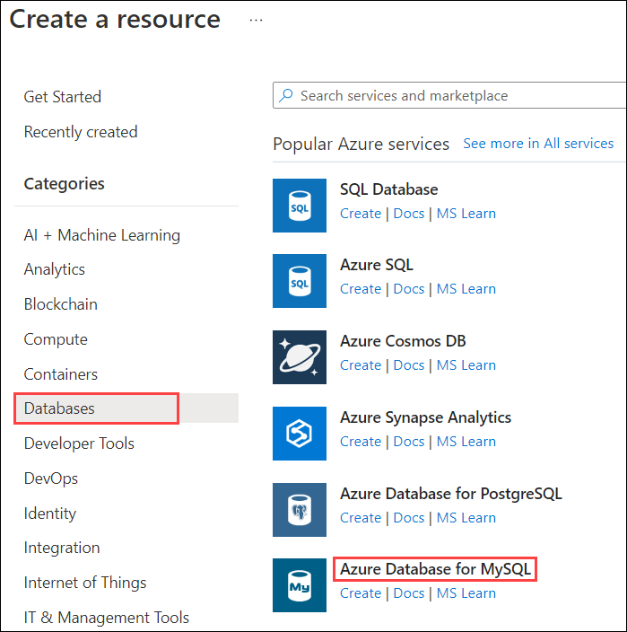

3. On **Select Azure Database for MySQL deployment option** page, click on **Create** under **Flexible Server**.

    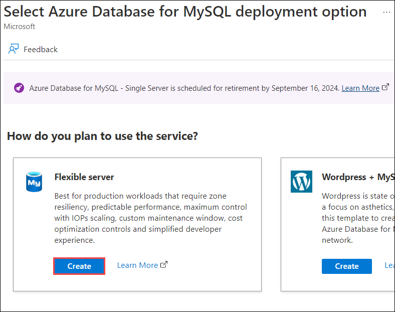

4.  Use these values to fill out the first section of the form.

    | Setting | Value  |
    | --- | --- |
    | Subscription | **Default Subscription** |
    | Resource group | **DP900-DID** |

5.  Under Server details, use these values:

    | Setting | Value  |
    | --- | --- |
    | Server name | Enter **mysqlDID**, where **DID** is the DeploymentID can be obtained from the Lab Environment output page. |
    | Region | **Select the default location** |
    | MySQL version | **Keep default setting** |
    
    
    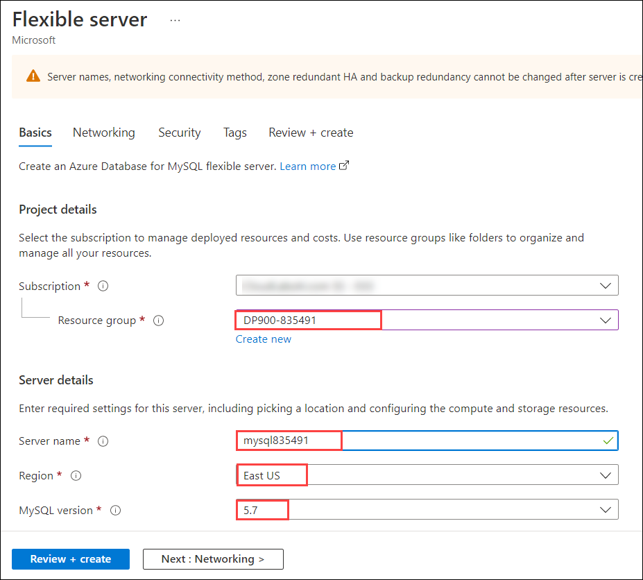

6.  Under **Compute + storage**, select **Configure server**.

    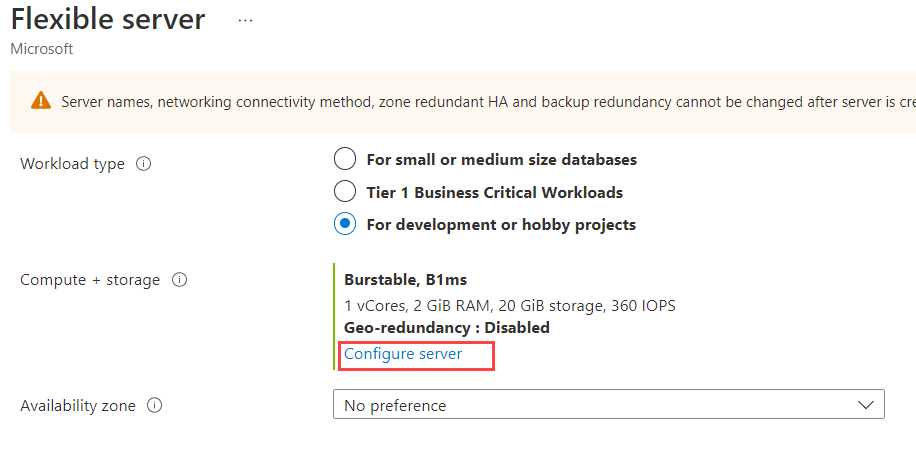

7.  On the Compute + storage page, select **Compute tier** as **General Purpose (2-64 vCores)**, reduce **Storage size** to **64 GB**, reduce **IOPS** to **492**, change Backup Retention Period to **14 days**, and then select **Save**.

    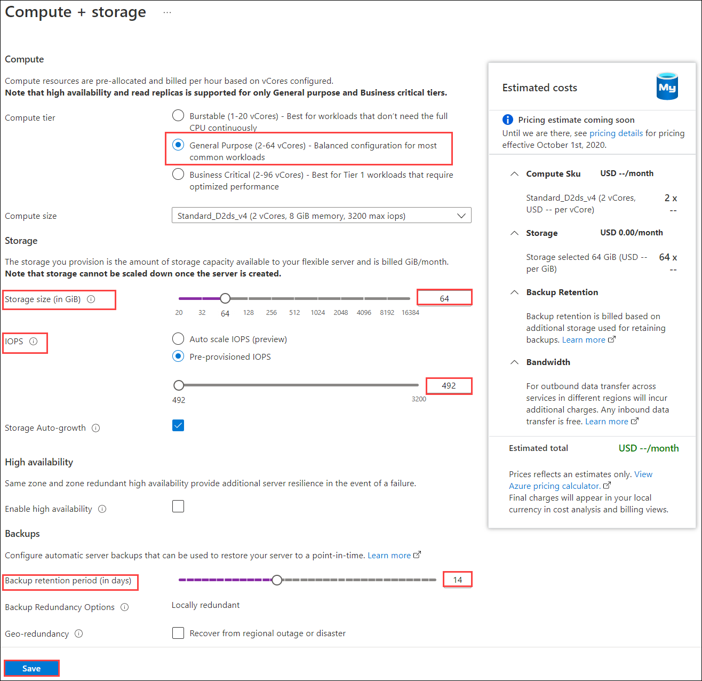 

8.  Back on the Flexible server page, under Authentication, use these values:

    | Setting | Value  |
    | --- | --- |
    | Admin username | **azureadmin** |
    | Password | **Pa55w.rd** |
    | Confirm password | **Pa55w.rd** |
    
    
    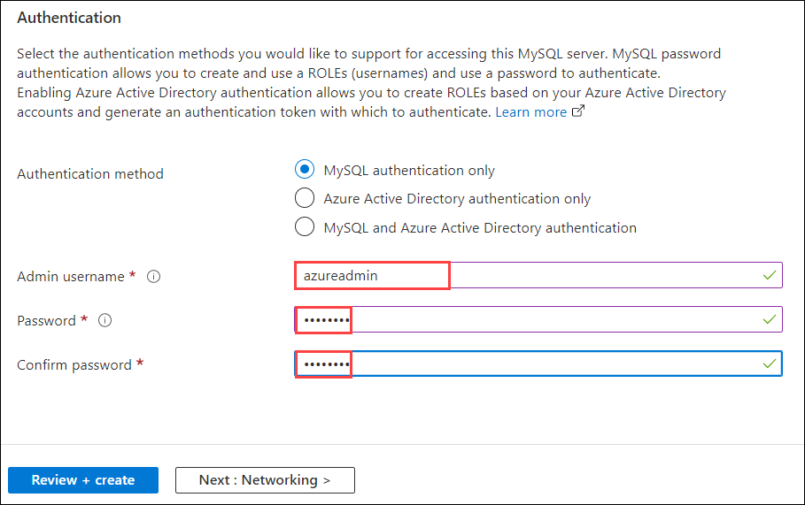

9.  Select **Review + Create**, and then select **Create** to create your Azure MySQL database.

    > **Note:** If prompted with **Configure IP address in firewall rules** pop-up, click on **Create server without firewall rules**.

## Congratulation, you have completed this lab.
------------
