# Lab 01: Explore Azure SQL Database

## Lab Overview

In this lab, you'll provision an Azure SQL Database resource in your Azure subscription, and then use SQL to query the tables in a relational database. 

## Lab Objective

In this lab, you will perform:

+ Task 1: Provision an Azure SQL Database resource

## Estimated timing: 30 minutes

## Architecture diagram

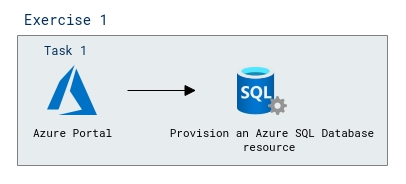

### Exercise 1: Provision Azure relational database services

In this exercise, you will provision an Azure SQL Database and use the **Query editor (preview)** to interact with it. You will explore the database structure by expanding the **Tables** folder and executing SQL queries. Finally, you will modify and run a query to retrieve specific columns, verifying the database's functionality.

#### Task 1: Provision an Azure SQL Database resource

1. In the Azure portal, click **+ Create a resource** in the upper left corner.

   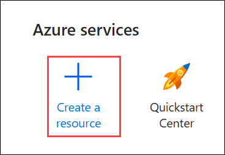

1. Search for **Azure SQL (1)** and select **Azure SQL (2)**.

   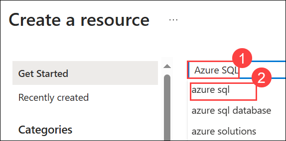

1. On the **Azure SQL** page, open the **Create (1)** dropdown and select **Azure SQL (2)**.

   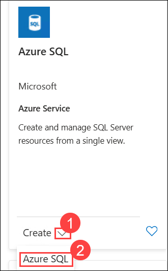
    
1. Review the Azure SQL options that are available, and then in the  **SQL databases (1)**  tile, ensure  **Single database (2)** is selected and select  **Create (3)**.
    
    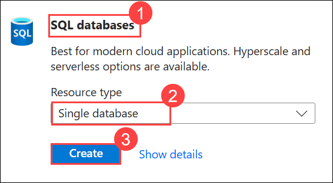
    
1. Enter the following values on the  **Create SQL Database**  page:
    
    - **Subscription**: Leave the default subscription **(1)**.
    - **Resource group**: select existing resource group with a name **Dp900-module1-<inject key="DeploymentID" enableCopy="false"/> (2)**.
    - **Database name**:  **AdventureWorks (3)**
    - **Server**: Select  **Create new (4)** 

      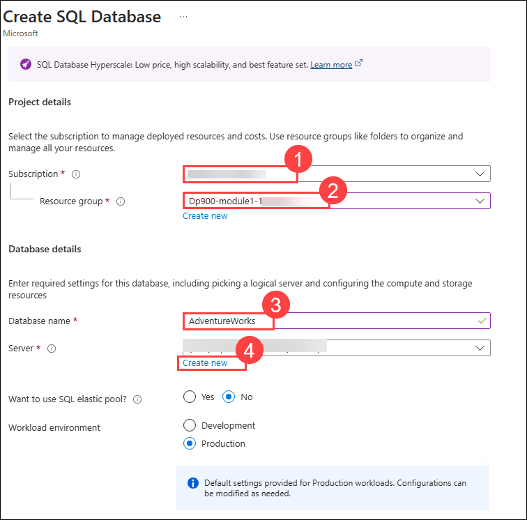    
    
    - Create a new server with the following details:
    
        - Sever name: **sqlserver<inject key="DeploymentID" enableCopy="false"/> (1)** 
        - Location: Any available location **(2)**
        - Authentication method: Choose **Use SQL authentication (3)**
        - Sever admin login: **azureuser (4)** 
        - Password - **Password.1!! (5)** (remember the password - you'll need it later!)
        - Confirm Password: **Password.1!! (6)**
        - select **OK (7)**

          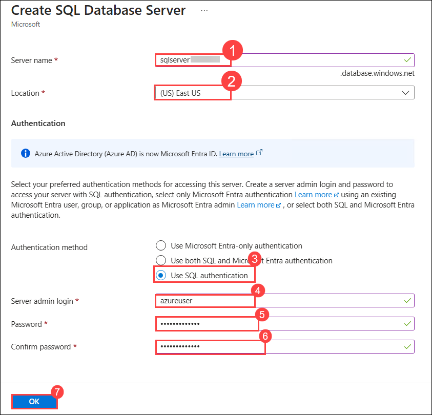

    - **Want to use SQL elastic pool?**:  **No (5)**

      

    - **Compute + storage**: Leave unchanged **(6)**
    - **Backup storage redundancy**:  **Locally-redundant backup storage (7)**
    - On the  **Create SQL Database**  page, select  **Next :Networking > (8)**.

      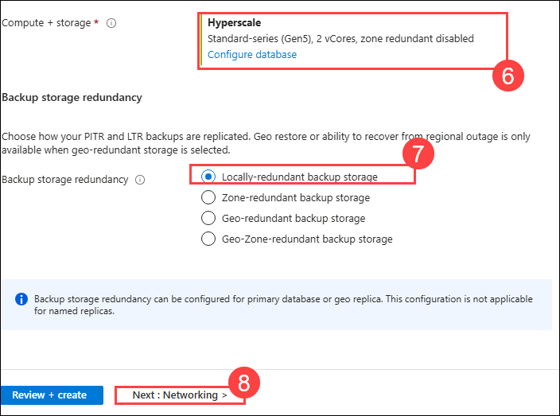

1. On the **Networking**  page, in the  **Network connectivity**  section, select  **Public endpoint (1)**. Select  **Yes (2)**  for both options in the  **Firewall rules**  section to allow access to your database server from Azure services and your current client IP address. and then select  **Next: Security > (3)**  

    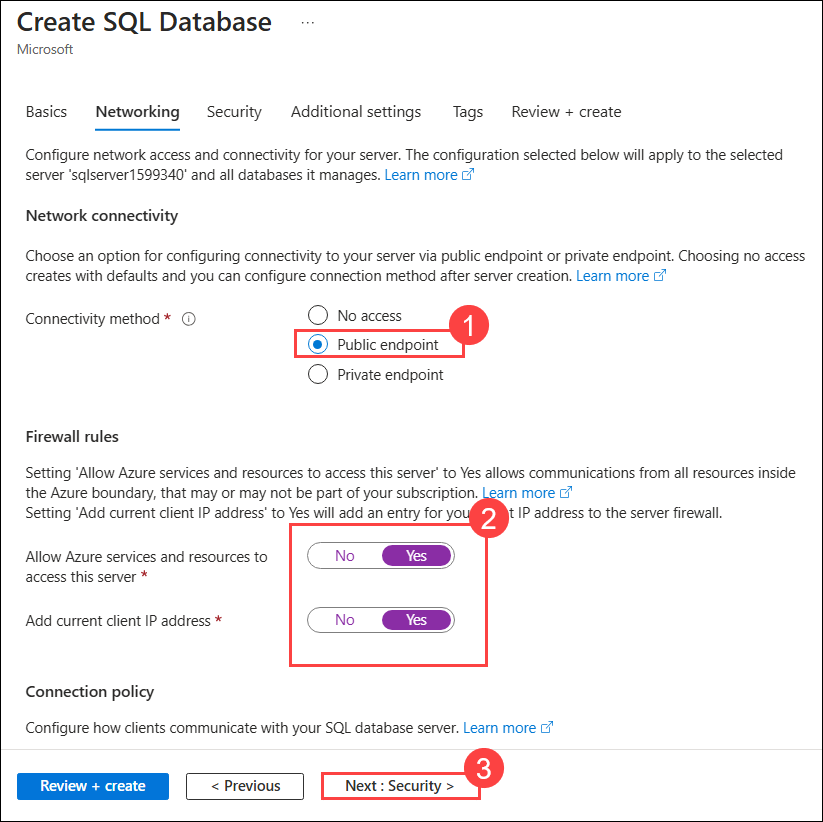

1. Set the  **Enable Microsoft Defender for SQL**  option to  **Not now (1)** and select  **Next: Additional Settings > (2)**.  

    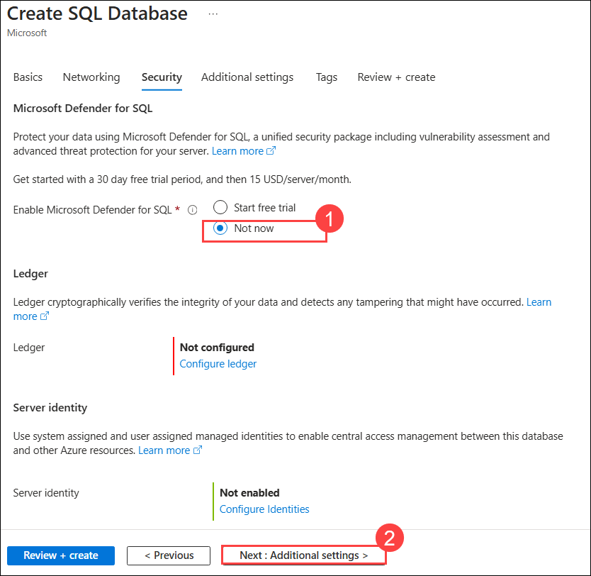

1. On the **Additional settings**  tab, set the  **Use existing data**  option to  **Sample (1)**  (this will create a sample database that you can explore later) then select **OK (2)**. and then select  **Review + Create (3)**.

    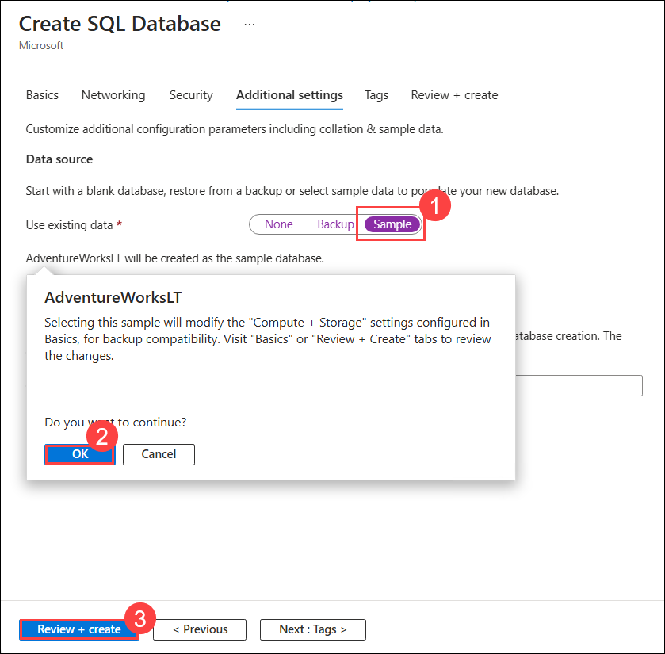

1. Then select  **Create**  to create your Azure SQL database.
    
1. Wait for deployment to complete. Then click on **Go to resource** to go to the resource that was deployed. 
    
    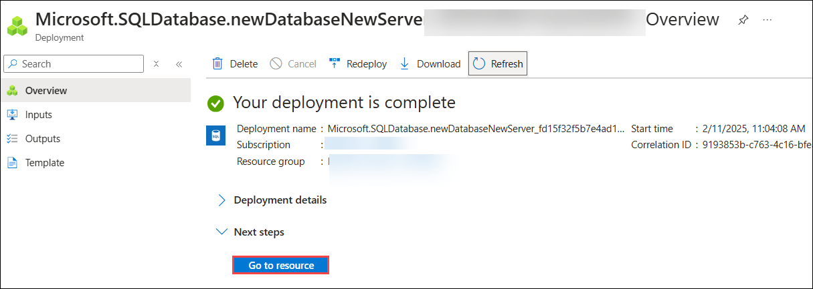

    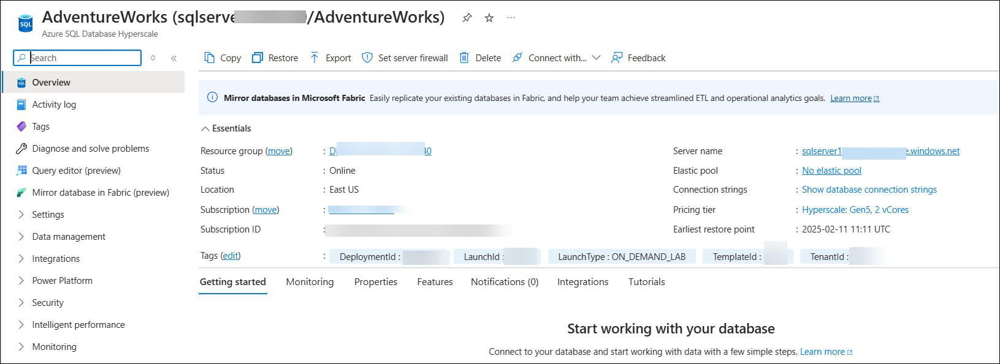    
     
1. In the pane on the left side of the page, select  **Query editor (preview)**.

    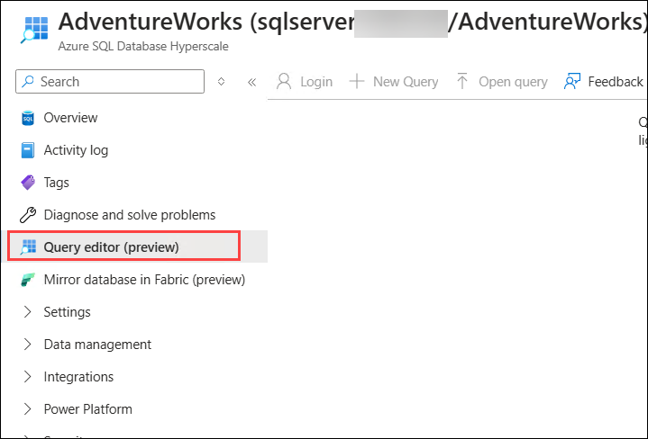

1. Sign in using the administrator login and password you specified for your server, then select **OK (3)**.

    - Login: **azureuser (1)**
    - Password: **Password.1!! (2)**  

      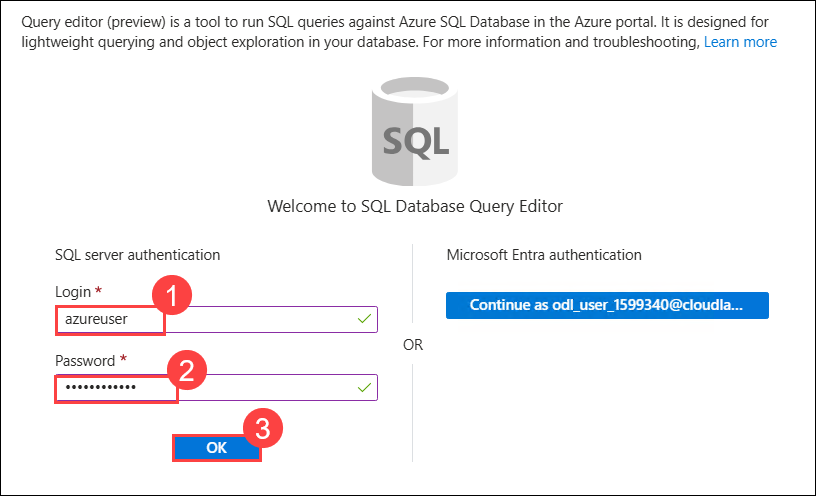    
    
       >**Note:** _If an error message stating that the client IP address isn't allowed is displayed, select the  **Allowlist IP ...**  link at the end of the message to allow access and try to sign in again (you previously added you own computer's client IP address to the firewall rules, but the query editor may connect from a different address depending on your network configuration.)_
    
1. The query editor looks like this:
    
   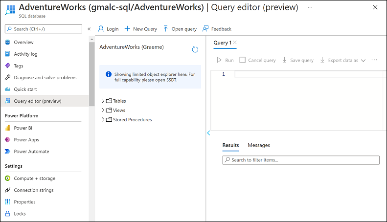
    
1. Expand the  **Tables (1)**  folder to see the tables in the database.
    
1. In the  **Query 1**  pane, enter the following SQL code: **(2)**

    ```sql
    SELECT * FROM SalesLT.Product;
    ```

   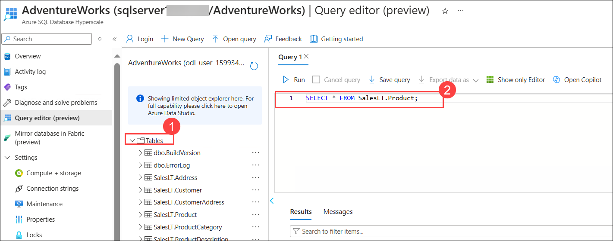    
    
1. Select  **▷ Run**  above the query to run it and view the results, which should include all columns for all rows in the  **SalesLT.Product**  table as shown here:
    
     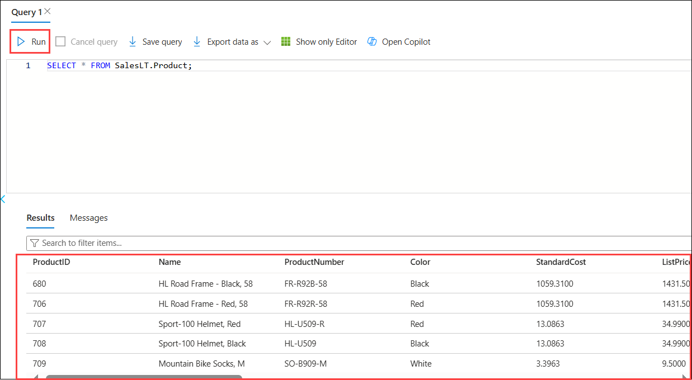
     
1. Replace the existing code with the following code **(1)**, and then select **&#9655; Run (2)** to run the new query and review the results (which includes only the **ProductID**, **Name**, **ListPrice**, **ProductCategoryID** columns): **(3)**

    ```sql
    SELECT ProductID, Name, ListPrice, ProductCategoryID
    FROM SalesLT.Product;
    ```

     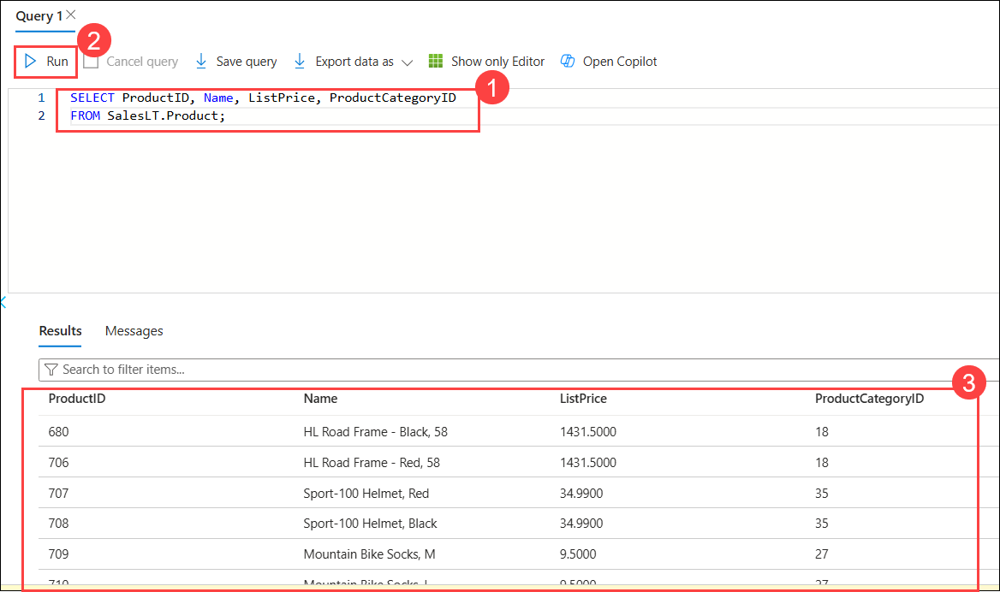    

1. Now try the following query, replace the existing query **(1)**, and then select **&#9655; Run (2)** to run the new query which uses a JOIN to get the category name from the **SalesLT.ProductCategory** table and eview the results: **(3)**

    ```sql
    SELECT p.ProductID, p.Name AS ProductName,
            c.Name AS Category, p.ListPrice
    FROM SalesLT.Product AS p
    JOIN [SalesLT].[ProductCategory] AS c
        ON p.ProductCategoryID = c.ProductCategoryID;
    ```

    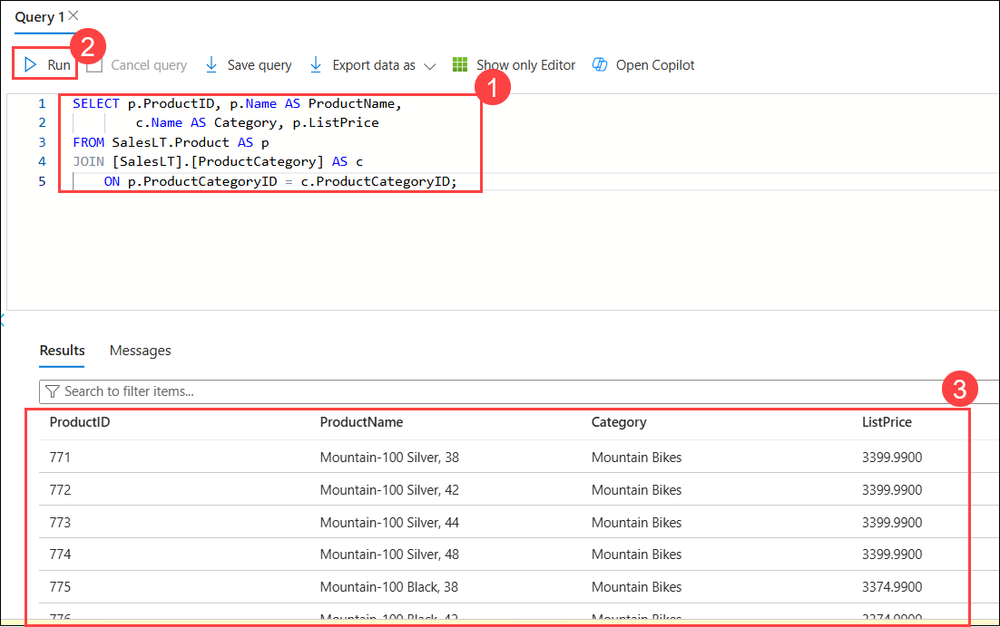

1. Close the query editor pane, discarding your edits.
  
    > **Congratulations** on completing the task! Now, it's time to validate it. Here are the steps:
    > - Hit the Validate button for the corresponding task.
    > - If you receive a success message, you can proceed to the next task. If not, carefully read the error message and retry the step, following the instructions in the lab guide.
    > - If you need any assistance, please contact us at labs-support@spektrasystems.com. We are available 24/7 to help you out.

    <validation step="7f10f2bd-f82a-4e4f-8fae-b31a8c7902df" />

## Review
In this lab, you have completed:
- Provision an Azure SQL Database resource
  
## You have successfully completed this lab
