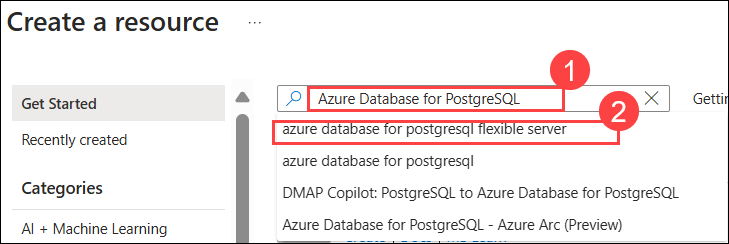

# Lab 01a: Explore Azure Database for PostgreSQL

## Lab scenario
In this lab, you'll provide an Azure Database for PostgreSQL resources for your Azure subscription.

## Lab objective

In this lab, you will perform:

+ Task 1: Provision an Azure Database for PostgreSQL resource
  
## Estimated timing: 15 minutes

## Architecture diagram

  

## Lab Prerequisites

Before starting this lab, you should have the following prerequisites:

   - **Azure Subscription** – An active Azure account with permissions to create and manage Azure Database for PostgreSQL resources.
   - **Basic PostgreSQL Knowledge** – Understanding of PostgreSQL databases, including tables and queries.

## Exercise 1: Explore Azure Database for PostgreSQL

In this exercise, you'll provision an Azure Database for PostgreSQL resources.

### Task 1: Provision an Azure Database for PostgreSQL resource

In this task, you'll create an Azure Database for PostgreSQL resources for your Azure subscription.
 
1. In the Azure portal, select **&#65291; Create a resource** (1) from the upper left-hand corner.

      

 1. Search for **Azure Database for PostgreSQL (1)**. From the marketplace select the **Azure Database for PostgreSQL Flexible Server (2)**.
 
    

1. Then in the **Azure Database for PostgreSQL**tile, click on **Create (1)** drop down and select  **Azure Database for PostgreSQL Flexible server (2)**.

    

1. Enter the following values on the **Create SQL Database** page:
    - Subscription: Leave your default Azure subscription **(1)**
    - Resource group: Choose the existing resource group **Dp-900-lab01a-<inject key="DeploymentID" enableCopy="false"/> (2)**
    - Server name: **postgresql-<inject key="DeploymentID" enableCopy="false"/> (3)**
    - Region: Select **EastUS (4)**.
    - PostgreSQL version: Leave unchanged **(5)**
    - Workload type: Select **Development (6)**
    - Compute + storage: Leave unchanged **(7)**

        

    - Availability zone: Leave unchanged **(8)**
    - Enable high availability: Leave unchanged **(9)**

        

    - Authentication method: select **PostgreSQL authentication only (10)** 
    - Admin username: **azureuser (11)**
    - Password: **Password1.!! (12)**
    - Confirm password: **Password1.!! (13)**
    - Select **Next: Networking > (14)**.

            

1. Under **Firewall rules**, select **&#65291; Add current client IP address (1)**. Select **Review + Create (2)**.

    

1. Then select **Create** to create your Azure PostgreSQL database.

1. Wait for deployment to complete. Then select **Go to resources** to go to the resource that was deployed, which should look like this:

    

1. Review the options for managing your Azure Database for PostgreSQL resources.

    >**Congratulations** on completing the Task! Now, it's time to validate it. Here are the steps:

  > - Hit the Validate button for the corresponding task. If you receive a success message, you have successfully validated the lab. 
  > - If not, carefully read the error message and retry the step, following the instructions in the lab guide.
  > - If you need any assistance, please contact us at labs-support@spektrasystems.com.

   <validation step="98b27e93-ba07-43ac-9822-f875f8539b25" />

## Review
In this lab, you have completed:
- Provision an Azure Database for PostgreSQL resource
  
## You have successfully completed this lab
