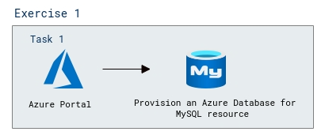
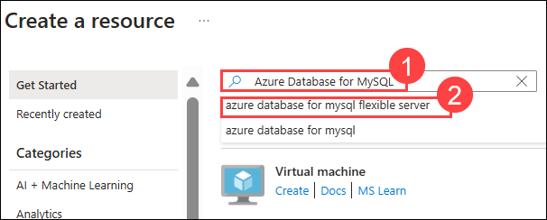
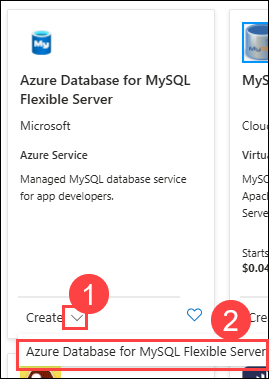
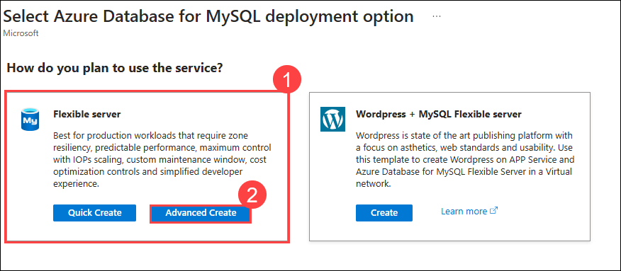
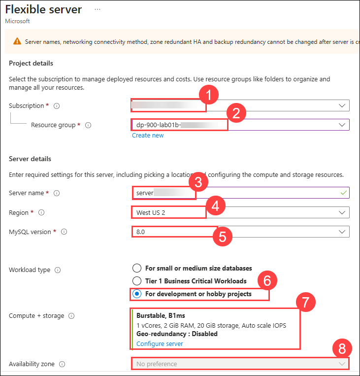
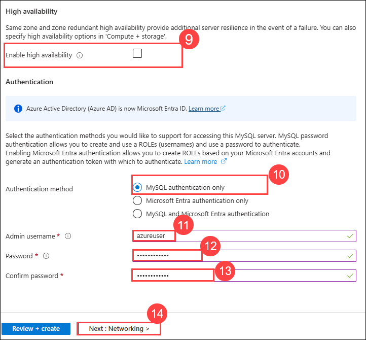
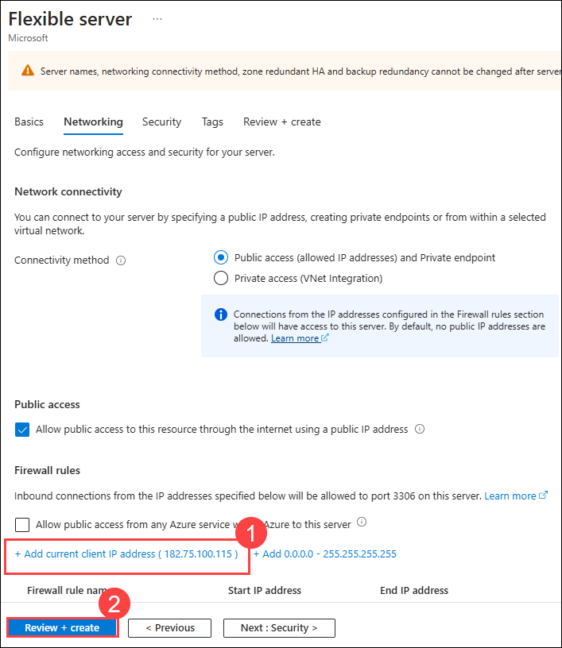
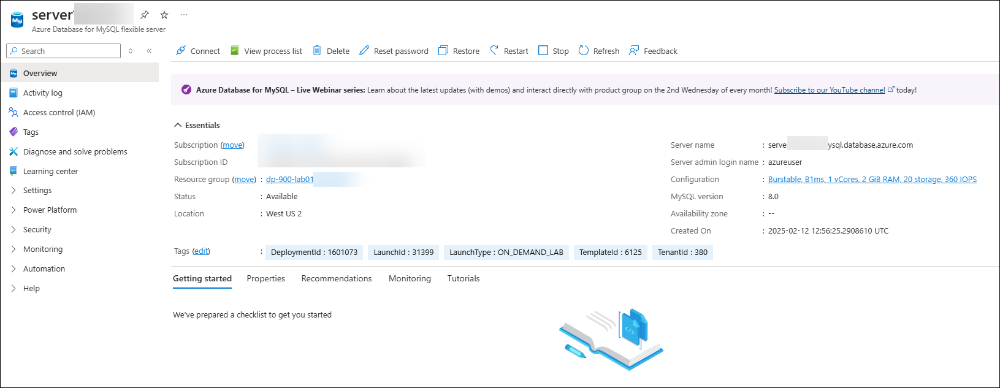

# Lab 01b: Explore Azure Database for MySQL

## Lab scenario
In this lab, you'll provision an Azure Database for MySQL resource in your Azure subscription.

## Lab objective

In this lab, you will perform:

+ Task 1: Provision an Azure Database for MySQL resource
  
## Estimated timing: 15 minutes

## Architecture diagram

  

## Lab Prerequisites

Before starting this lab, you should have the following prerequisites:

   - **Azure Subscription** – An active Azure account with permissions to create and manage Azure Database for MySQL resources.
   - **Basic MySQL Knowledge** – Understanding of MySQL databases, including tables and queries.

## Exercise 1: Provision an Azure Database for MySQL resource

In this exercise, you'll provision an Azure Database for MySQL resource.

### Task 1: Provision an Azure Database for MySQL resource

1. In the Azure portal, select **&#65291; Create a resource** from the upper left-hand corner.

    

1. Search for **Azure Database for MySQL (1)**. From the marketplace select the **Azure Database for MySQL Flexible Server (2)**.

    
 
1. On the **Azure Database for MySQ Flexible Server**, click on **Create** drop down and select **Azure Database for MySQ Flexible Server (2)**.
    
    

1. On **Select Azure Database for MySQL deployment option** page, in **Flexible server (1)** choose **Advanced create (2)**.

    

1. Enter the following values on the **Create SQL Database** page:
   - Subscription: Leave the default subscription **(1)**
   - Resource group: Choose the existing resource group **dp-900-lab01b-<inject key="DeploymentID" enableCopy="false"/> (2)**.
   - Server name: **server<inject key="DeploymentID" enableCopy="false" /> (3)**
   - Region: **West US 2** **(4)**
   - MySQL Version: Leave unchanged **(5)**
   - Workload type: **For development or hobby projects (6)** 
   - Compute + storage: Leave unchanged **(7)**
   - Availability zone: Leave unchanged **(8)**

     

   - Enable high availability: Leave unchanged **(9)**
   - Authentication method: **MySQL authentication only (10)**
   - Admin username: **Student (11)**
   - Password: **Password@1 (12)**
   - Confirm password : **Password@1 (13)**
   - Select **Next: Networking (14)**

        

1. Under **Firewall rules**, select **&#65291; Add current client IP address (1)** and then click on **Review + Create (2)**. 

   

1. Select **Review + Create**, and then select **Create** to create your Azure MySQL database.

1. Wait for deployment to complete. Click on **Go to resources** to go to the resource that was deployed, which should look like this:

   
    
   >**Note**: The deployment might take a minute or two.

1. Review the options for managing your Azure Database for MySQL resource.

  >**Congratulations** on completing the Task! Now, it's time to validate it. Here are the steps:
  > - Hit the Validate button for the corresponding task. If you receive a success message, you have successfully validated the lab. 
  > - If not, carefully read the error message and retry the step, following the instructions in the lab guide.
  > - If you need any assistance, please contact us at labs-support@spektrasystems.com.

   <validation step="b62e8efa-2544-4f0f-a6f7-297eed28d9c1" />
   
## Review
In this lab, you have completed:
- Provision an Azure Database for MySQL resource
  
## You have successfully completed this lab
