# Lab 02: Explore Azure Storage

## Lab scenario
In this lab, you'll provision an Azure Storage account in your Azure subscription, and explore the various ways you can use it to store data.

## Lab Objectives

In this lab, you will perform following tasks:

+ Task 1: Provision an Azure Storage account
+ Task 2: Explore blob storage
+ Task 3: Explore Azure Data Lake Storage Gen2
+ Task 4: Explore Azure Files
+ Task 5: Explore Azure Tables
  
## Estimated timing: 15 minutes

## Architecture diagram

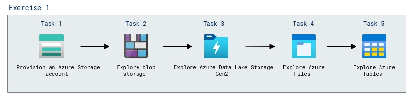  

## Exercise 1: Explore Azure Storage

In this exercise you'll provision an Azure Storage account in your Azure subscription, and explore the various ways you can use it to store data.

#### Task 1: Provision an Azure Storage account

In this task, you will create an Azure Storage account in your Azure subscription as an initial step in working with Azure Storage.

1. On the Azure portal home page, select  **＋ Create a resource**  from the upper left-hand corner. 

    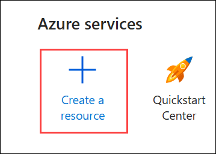

1. Search for **Storage account (1)** and select **Storage account (2)**.

    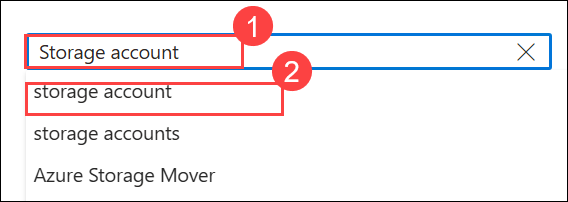

1. On the **Storage account** page, click on the **Create (1)** dropdown and select **Storage account (2)**.    

    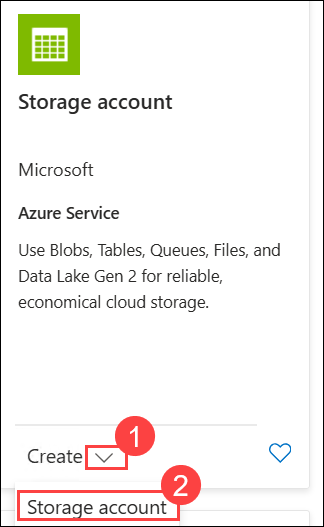
    
1. Enter the following values on the  **Create a storage account**  page:
    
    - Subscription: **Leave default Azure subscription (1)**
    - Resource group:Choose the existing resource group **DP-900-Module2-<inject key="DeploymentID" enableCopy="false"/> (2)**
    - Storage account name: **str<inject key="DeploymentID" enableCopy="false"/> (3)**.
    - Region: **Select any available location (4)**.
    - Performance:  **Standard (5)**
    - Redundancy:  **Locally-redundant storage(LRS) (6)**
    - Click on **Next** thrice, to navigate to **Data protection** tab.

      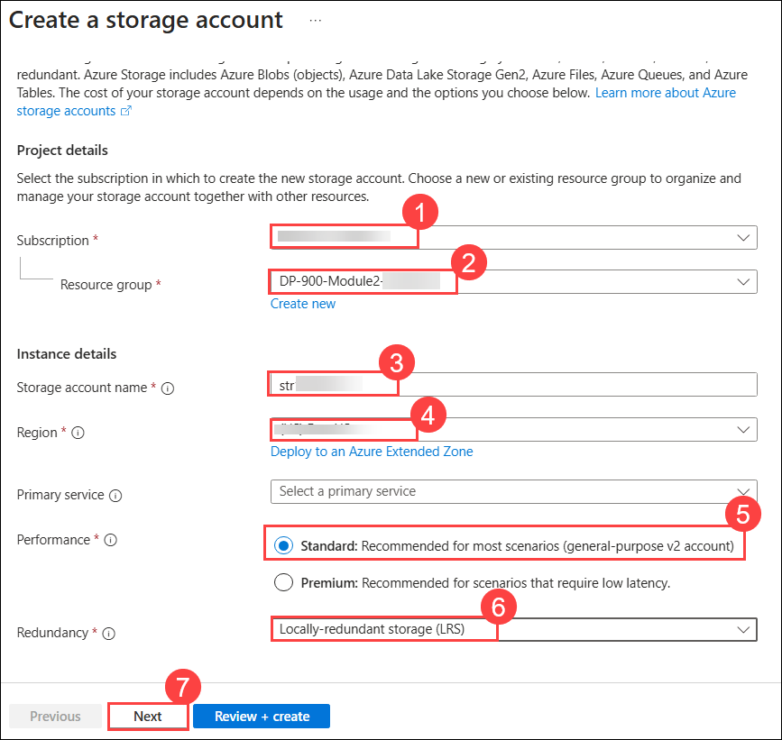    
  
1. On the **Data protection** tab, in the  **Recovery**  section,  deselect all of the  **Enable soft delete... (1)**  options. These options retain deleted files for subsequent recovery, but can cause issues later and then click on **Review+create (2)**.

    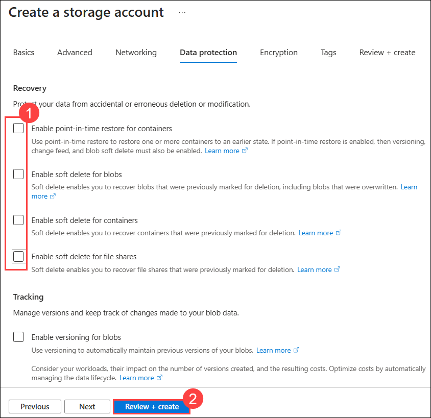
    
1. Select  **Create**  to create your Azure Storage account.
   
1.  Wait for deployment to complete. Then click on **Go to resouce** to go to the resource that was deployed.

    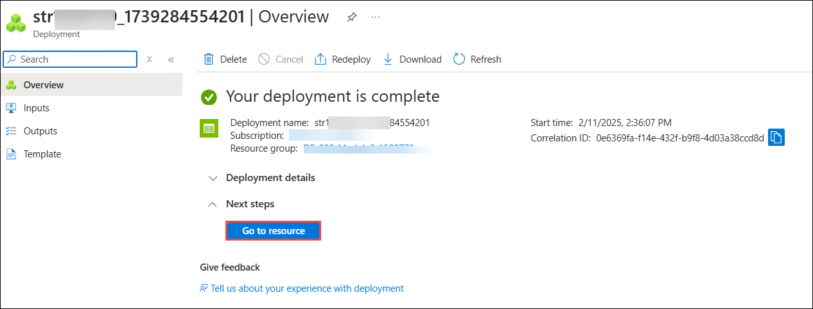
    
#### Task 2 : Explore blob storage

In this task, you will create a blob container to store and manage data within your Azure Storage account.

1. Right click on the following link, https://aka.ms/product1.json, then click on **copy link** and then paste it on the browser. It will download the **product1.json** JSON file and press **Ctrl+S** to save it on your computer (you can save it in any folder - you'll upload it to blob storage later).

1. Select **Downloads (1)**, keep the file name as **product1 (2)** then make sure that **Save as type** is **JSON** and click on **Save (3)**.

    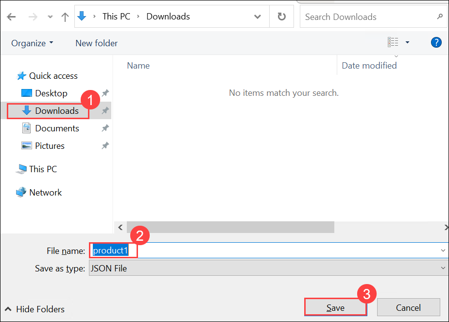
    
     >**Note:** If the JSON file is displayed in your browser, save the page as **product1.json**.
    
1. In the Azure portal page go to the newly created storage account for your storage container, on the left side, in the  **Data storage**  section, select  **Containers**.

    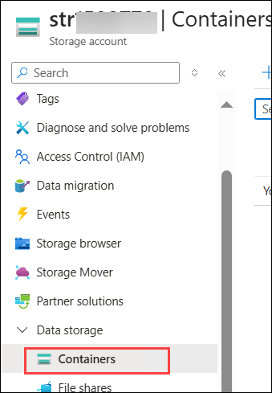
    
1. In the **Containers** page, select **&#65291; Container** and add a new container named **data (1)** with an anonymous access level of **Private (no anonymous access) (2)** and then click on **Create (3)**.

    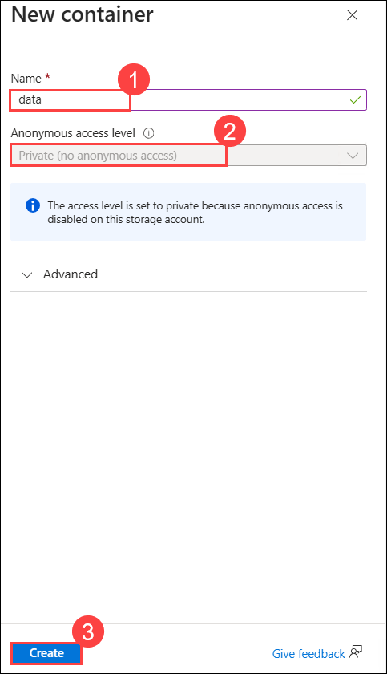

1. When the  **data**  container has been created, verify that it's listed in the  **Containers**  page.

    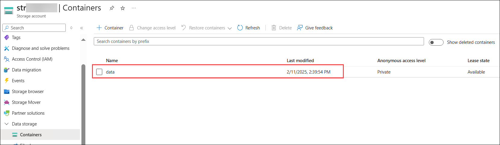
    
1. Go back to the storage account, in the pane on the left side, in the top section, select  **Storage browser (1)**. In the storage browser page, select  **Blob containers (2)**.

    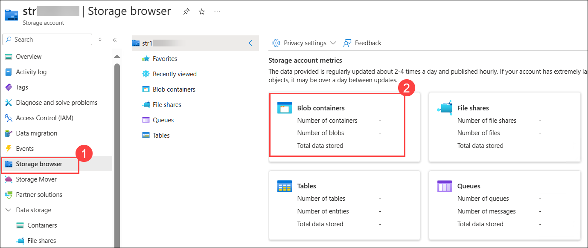  

1. Verify that your  **data**  container is listed. Select the  **data**  container, and note that it's empty.    

    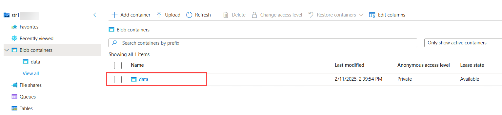
    
1.  Select  **＋ Add Directory**.

    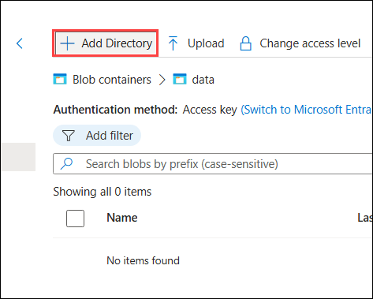

1. Create a new directory named  **products** and click on **Ok**.

    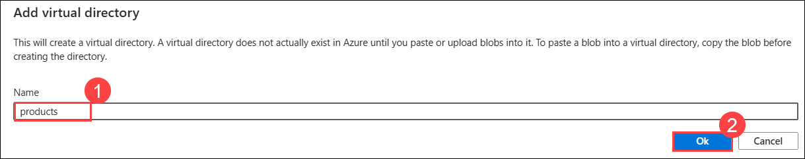
    
1. In Storage Explorer, verify that the current view shows the contents of the  **products**  folder you just created - observe that the "breadcrumbs" at the top of the page reflect the path  **Blob containers > data > products**.

    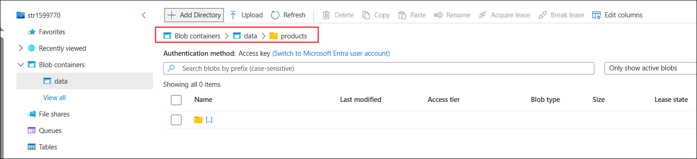

1. In the breadcrumbs, select **data** to switch to the **data** container.

    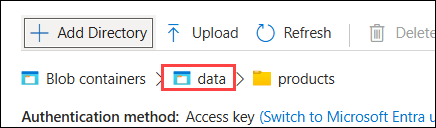

1. Note that it does <u>not</u> contain a folder named **products**.

    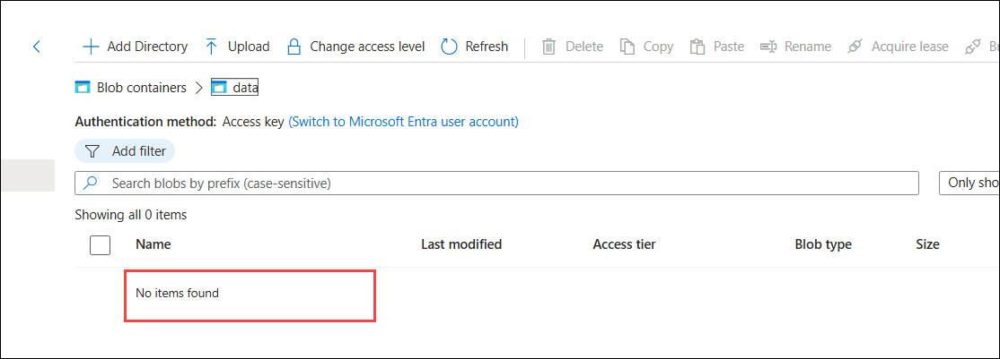

     >**Note:** Folders in blob storage are virtual, and only exist as part of the path of a blob. Since the **products** folder contained no blobs, it isn't really there!
      
1. Use the  **⤒ Upload**  button to open the  **Upload blob**  panel.

    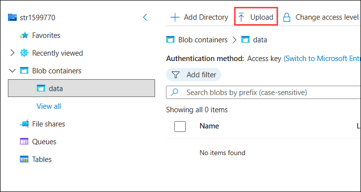
    
1. In the  **Upload blob**  panel, select the **Browse for files (1)**, navigate to **Dowloads (2)** then select **product1.json (3)** file you saved on your local computer previously and then click on **Open (4)**. 

    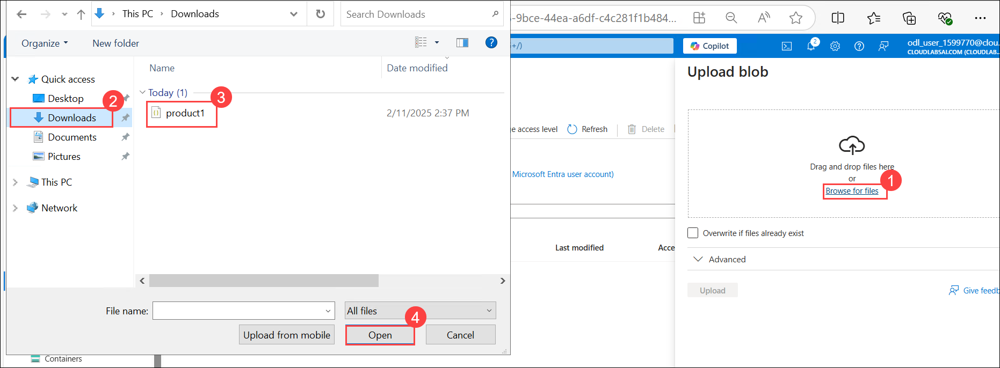

1. Then expand **Advanced (1)**  section, in the  **Upload to folder**  box, enter  **product_data (2)**  and select the  **Upload (3)**  button.

    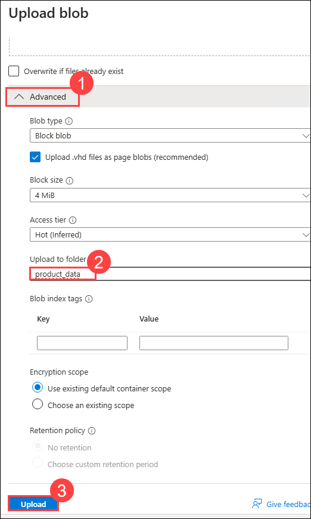
    
1. Close the  **Upload blob**  panel if it's still open, and verify that a  **product_data**  virtual folder has been created in the  **data**  container.

    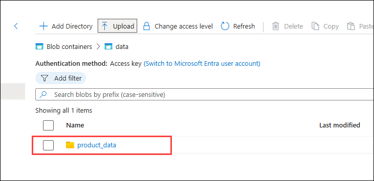
    
1. Select the  **product_data**  folder and verify that it contains the  **product1.json**  blob you uploaded.

    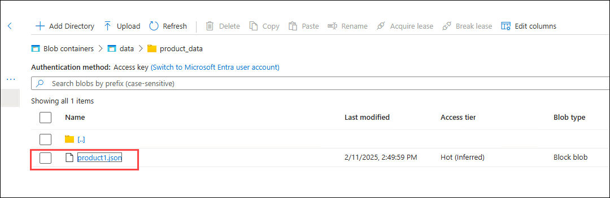
   
1. On the left side, in the  **Data storage**  section, select  **Containers**.
    
1. Open the  **data**  container, and verify that the  **product_data**  folder you created is listed.

     
    
1. Select the  **elipses(...)**  icon at the right-end of the folder, and note that it doesn't display any options. Folders in a flat namespace blob container are virtual, and can’t be managed.

    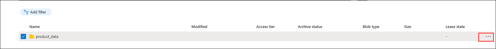
    
1. Use the  **X**  icon at the top right in the  **data**  page to close the page and return to the  **Containers**  page.
    

#### Task 3:  Explore Azure Data Lake Storage Gen2

In this task, you will use Azure Data Lake Store Gen2 to organize and manage access to blobs with hierarchical folders. You will also leverage Azure Blob Storage to host distributed file systems for big data analytics platforms.

1.  Download the [product2.json](https://aka.ms/product2.json?azure-portal=true)  JSON file by right click on the following link, `https://aka.ms/product2.json` then select **Copy link** and then paste it on the browser.

1. Press **Ctrl+S** to save file on your computer in the same folder where you downloaded product1.json previously - you'll upload it to blob storage later.

1. Select **Downloads (1)**, keep the file name as **product2 (2)** then make sure that **Save as type** is **JSON** and click on **Save (3)**.

    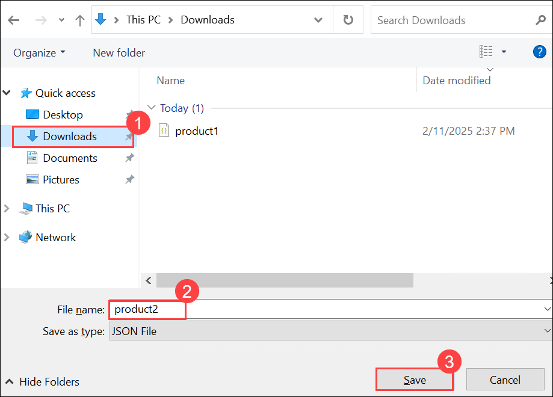

1. In the pane on the left side, in the top section, select  **Storage browser (1)**  and navigate back to the root of your  **data (2)**  blob container, which still contains the  **product_data (3)**  folder.

    

1. Select the  **product_data**  folder, and verify it still contains the  **product1.json**  file you uploaded previously.

    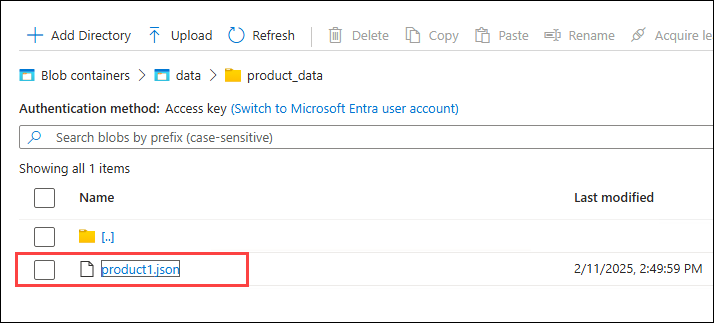

1. Use the  **⤒ Upload**  button to open the  **Upload blob**  panel.

    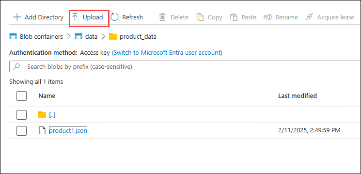

1. In the  **Upload blob**  panel, select the  **product2.json**  file you saved on your local computer.

1. In the  **Upload blob**  panel, select the **Browse for files (1)**, select **product2.json (2)** file you saved on your local computer previously and then click on **Open (3)**. 

    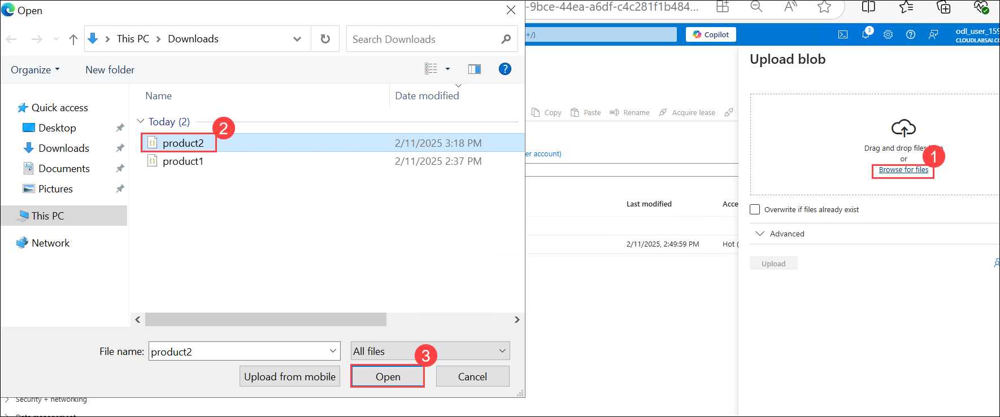

1. Then select the  **Upload**  button.

    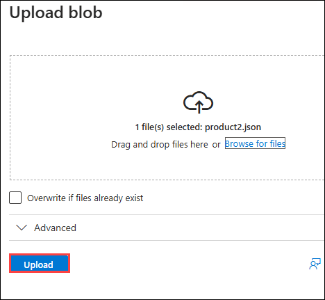

1. Close the  **Upload blob**  panel if it's still open, and verify that a  **product_data**  folder now contains the  **product2.json**  file.

    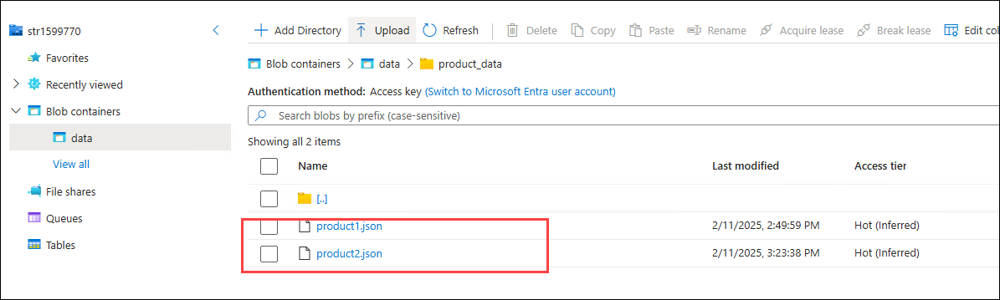 

1. On the left side, in the  **Data storage**  section, select  **Containers**.

1. Open the  **data**  container, and verify that the  **product_data**  folder you created is listed.

1. Use the  **X**  icon at the top right in the  **data**  page to close the page and return to the  **Containers**  page.

### Task 4 :  Explore Azure Files

In this task, you will create cloud-based file shares using Azure Files.

1. In the Azure portal displaying the storage container, on the left side, in the  **Data storage (1)**  section, select  **File shares (2)**.

    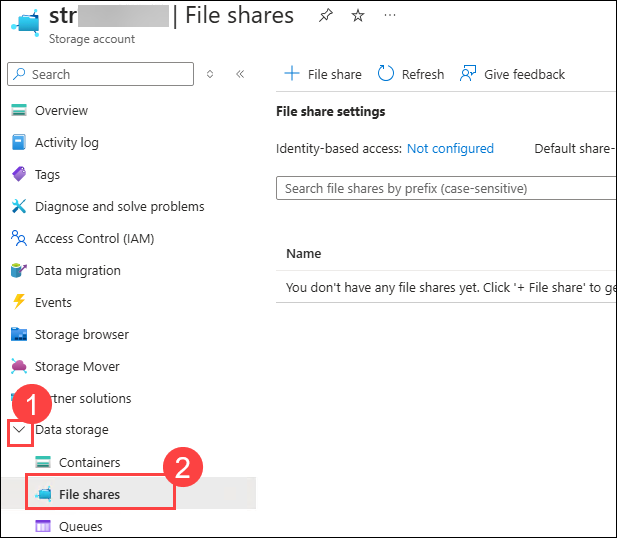

1. In the File shares page, select  **＋ File share**.

1. Add a new file share named  **files (1)**  using the  **Transaction optimized (2)**  tier and then click on **Next: Backup > (3)** 

    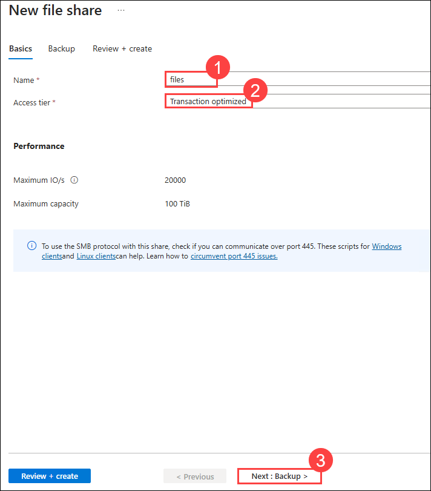

1. Make sure that **Enable backup** is disabled **(1)**. Then select **Review + create (2)**.

    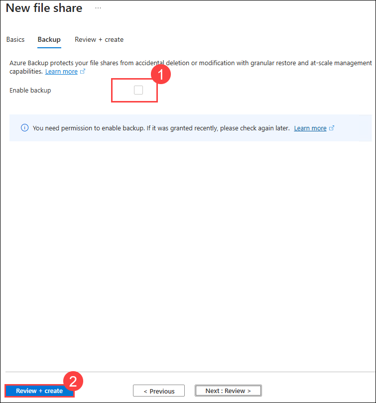

1. Click on **Create**.    

1. In the  **File shares (1)**, open your new  **files (2)**  share.

    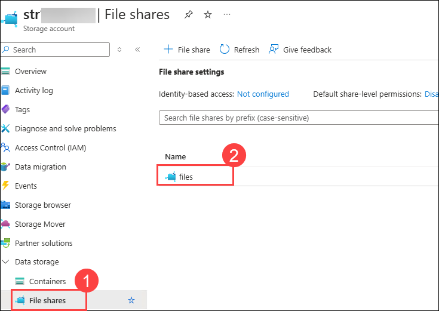

1. At the top of the page, select  **Connect (1)**. Then in the  **Connect**  pane, note that there are tabs for common operating systems (**Windows, Linux, and macOS (2)**)  that contain scripts you can run to connect to the shared folder from a client computer.

    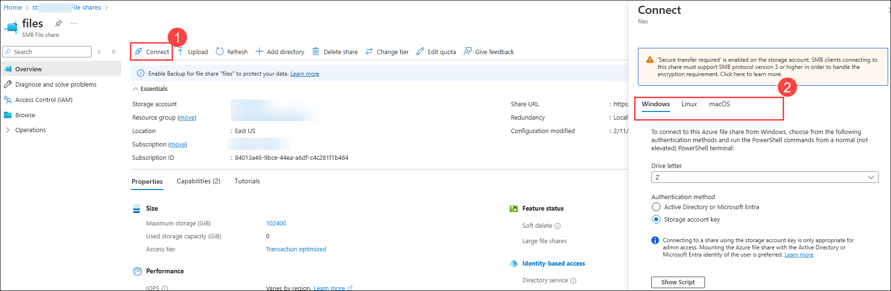

1. Close the  **Connect**  pane and then close the  **files**  page to return to the  **File shares**  page for your Azure storage account.

### Task 5 : Explore Azure Tables

In this task, you will use Azure Tables to store key-value data for applications that do not require the full functionality of a relational database.

1. In the Azure portal page for your storage container, on the left side, in the  **Data storage (1)**  section, select  **Tables (2)**.

    
    
1. On the  **Tables**  page, select  **＋ Table (1)**. Create a new table named  **products (2)** and then click on **OK (3)**.

    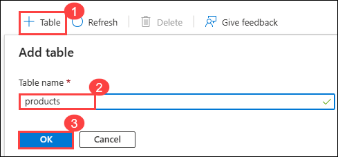
    
1. After the  **products**  table has been created, in the pane on the left side, in the top section, select  **Storage browser**.
    
1. In storage explorer, select  **Tables**  and verify that the  **products**  table is listed.

    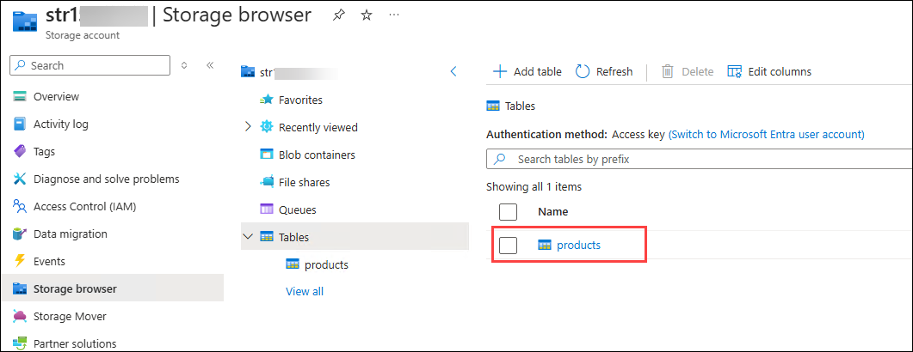
    
1. Select the  **products**  table.
    
1. In the  **product**  page, select  **＋ Add entity**.
    
1. In the  **Add entity**  panel, enter the following key values:

    |Property name | Type | Value |
    | ------------ | ---- | ----- |
    | PartitionKey **(1)** | String | 1  |
    | RowKey **(2)** | String | 1 |
    
    - Select  **Add property**, and create a new property with the following values:
    
      |Property name | Type | Value |
      | ------------ | ---- | ----- |
      | Name **(3)** | String | Widget |
    
    - Add a second property with the following values:
    
      |Property name | Type | Value |
      | ------------ | ---- | ----- |
      | Price **(4)** | Double | 2.99 |
    
1. Select  **Insert (5)**  to insert a row for the new entity into the table.

     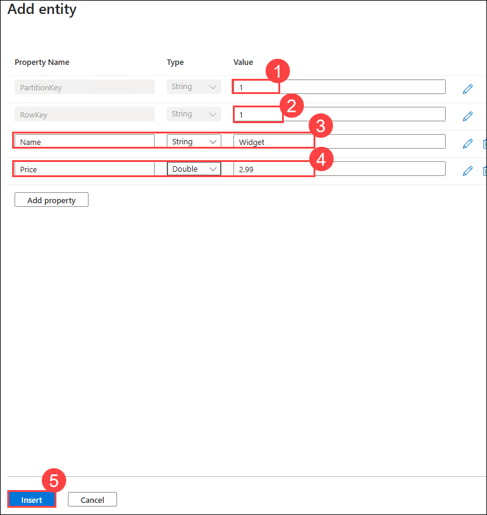
    
1. In storage browser, verify that a row has been added to the  **products**  table, and that a  **Timestamp**  column has been created to indicate when the row was last modified.

    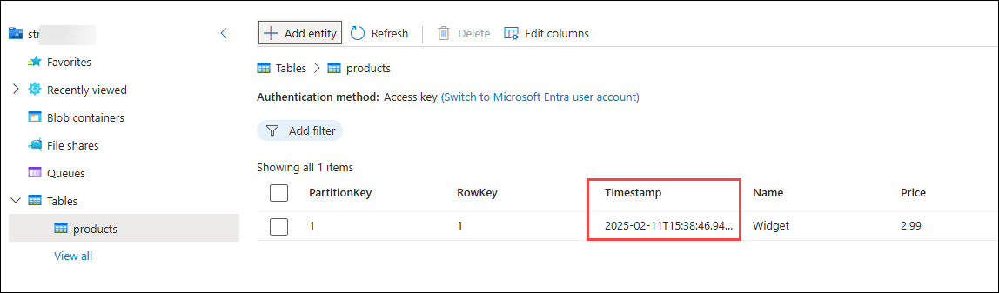
    
1. Add another entity to the **products** table with the following properties and then click on **Insert (5)**:

    |Property name | Type | Value |
    | ------------ | ---- | ----- |
    | PartitionKey | String | 1 **(1)** |
    | RowKey | String | 2 **(2)** |
    | Name | String | Kniknak **(3)** |
    | Price | Double | 1.99 **(4)** |
    | Discontinued | Boolean | true **(5)** |

     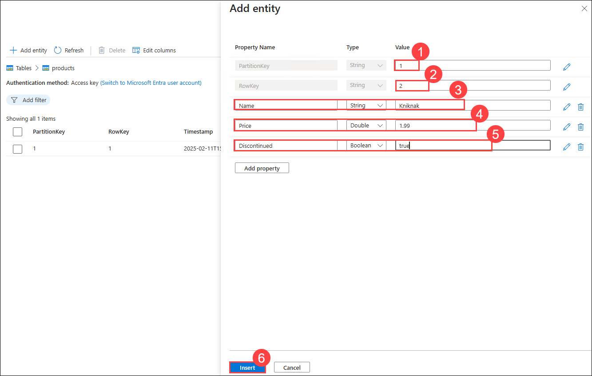    

13. After inserting the new entity, verify that a row containing the **discontinued** product is shown in the table.

    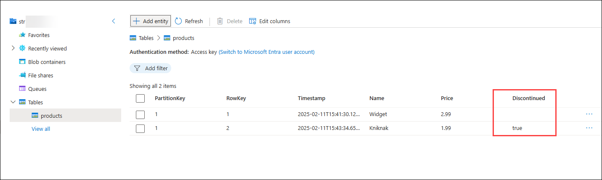
    
    >**Note**: You have manually entered data into the table using the storage browser interface. In a real scenario, application developers can use the Azure Storage Table API to build applications that read and write values to tables, making it a cost effective and scalable solution for NoSQL storage.

  >**Congratulations** on completing the Task! Now, it's time to validate it. Here are the steps:
  > - Hit the Validate button for the corresponding task. If you receive a success message, you have successfully validated the lab. 
  > - If not, carefully read the error message and retry the step, following the instructions in the lab guide.
  > - If you need any assistance, please contact us at labs-support@spektrasystems.com.

   <validation step="87f78207-9b57-4997-8cc1-072577be255b" />

## Review
In this lab, you have completed:
- Provision an Azure Storage account
- Explore blob storage
- Explore Azure Data Lake Storage Gen2
- Explore Azure Files
- Explore Azure Tables
  
## You have successfully completed this lab
