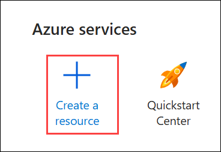
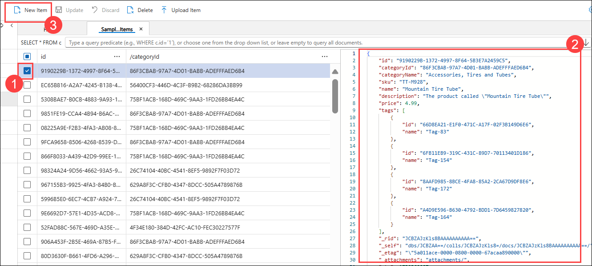

# Lab 03: Explore Azure Cosmos DB

## Lab scenario
In this lab, you'll provision an Azure Cosmos DB database in your Azure subscription, and explore the various ways you can use it to store non-relational data.

## Lab Objectives

In this lab, you will perform the following tasks:

+ Task 1: Create a Cosmos DB account
+ Task 2: Create a sample database
+ Task 3: View and create items
+ Task 4: Query the database

## Estimated timing: 15 minutes

## Architecture diagram


## Lab Prerequisites

Before starting this lab, you should have the following prerequisites:

  - **Azure Subscription** – An active Azure account with permissions to create and manage Azure Cosmos DB resources.
  - **Basic Database Concepts** – Understanding of NoSQL databases, collections, and querying data.

## Exercise 1: Explore Azure Cosmos DB

In this exercise, you will create and configure an Azure Cosmos DB account, set up a sample database, and manage data within it. You will explore how to view, create, and query items using the Data Explorer in the Azure portal.

### Task 1: Create a Cosmos DB account

In this task, you will create an Azure Cosmos DB account for NoSQL database using the Azure portal.

1.  In the Azure portal, select  **+ Create a resource** (1)  at the top left. 

    

1. Search for  **Azure Cosmos DB (1)**. In the results, select  **Azure Cosmos DB (2)**.

    

1. On the **Azure Cosmos DB** page, click on  **Create (1)** drop down and select **Azure Cosmos DB (2)**.

    

1. In the  **Azure Cosmos DB for NoSQL**  tile, select  **Create**.

    

1. Enter the following details, and then select  **Review + Create**:

    - Workload Type: Select **Developing/Testing (1)**
    - Subscription: Leave default Azure subscription **(2)**
    - Resource group: Select existing resource group **DP-900-Module-3-<inject key="DeploymentID" enableCopy="false"/> (3)**
    - Account Name: Enter **cosmosdb-<inject key="DeploymentID" enableCopy="false"/> (4)**
    - Availibility zone: Leave default **(5)**
    - Location: **West US 2 (6)**

      

    - Capacity mode: **Provisioned throughput (7)**
    - Apply Free-Tier Discount: Select **Apply (8)**
    - Limit total account throughput: Unselected **(9)**
    - Click on **Review+create (10)**

          

1. When the configuration has been validated, select  **Create**.

1. Wait for deployment to complete. Then go to the deployed resource.

### Task 2 : Create a sample database

In this task, you will create a sample database in your Azure Cosmos DB account.

*Throughout this procedure, close any tips that are displayed in the portal*.

1. On the page for your new Cosmos DB account, in the pane on the left, select **Data Explorer (1)**. In the **Data Explorer** page, select **Launch quick start (2)**.

    

1. In the **New container** tab, review the pre-populated settings for the sample database, and then select **OK**.

1. Observe the status until the **SampleDB** database and its **SampleContainer** container has been created (which may take a minute or so).

    

### Task 3 : View and create items

In this task, you will view existing items in your Azure Cosmos DB database and create new ones. Using the Data Explorer, you will browse stored data, add new items, and verify the changes in your database.

1. In the Data Explorer page, expand the  **SampleDB**  database and the **SampleContainer**, and select  **Items**  to see a list of items in the container. The items represent product data, each with a unique id and other properties.

    

    

1. Select any of the items in the list **(1)** to see a JSON representation of the item data **(2)** and at the top of the page, select  **New Item (3)**  to create a new blank item.

    

1. Modify the JSON for the new item as follows **(1)**, and then select  **Save (2)**.

    
    ```json
    {
        "name": "Road Helmet,45",
        "id": "123456789",
        "categoryID": "123456789",
        "SKU": "AB-1234-56",
        "description": "The product called \"Road Helmet,45\" ",
        "price": 48.74
    }
    ```

         
    
1. After saving the new item, notice that additional metadata properties are added automatically.

    

### Task 4  : Query the database

In this task, you will query the Azure Cosmos DB database to retrieve specific data. Using the Data Explorer, you will write and execute queries to filter and analyze the stored information.

1. In the  **Data Explorer**  page, select the  **New SQL Query**  icon.

    

1. In the SQL Query editor, review the default query (`SELECT * FROM c`) **(1)** and use the  **Execute Query (2)**  button to run it. Review the results, which includes the full JSON representation of all items. **(3)**

    

1. Modify the query as follows: **(1)**
   
    ```sql
    SELECT *
    FROM c
    WHERE CONTAINS(c.name,"Helmet")
    ```

1. Use the **Execute Query (2)** button to run the revised query and review the results, which includes JSON entities for any items with a **name** field containing the text `Helmet`. **(3)**

    

6.  Close the SQL Query editor, discarding your changes.
    
    >**Note**: You've seen how to create and query JSON entities in a Cosmos DB database by using the data explorer interface in the Azure portal. In a real scenario, an application developer would use one of the many programming language specific software development kits (SDKs) to call the core (SQL) API and work with data in the database.
    
  >**Congratulations** on completing the Task! Now, it's time to validate it. Here are the steps:
  > - Hit the Validate button for the corresponding task. If you receive a success message, you have successfully validated the lab. 
  > - If not, carefully read the error message and retry the step, following the instructions in the lab guide.
  > - If you need any assistance, please contact us at labs-support@spektrasystems.com.

   <validation step="99702646-3c86-4d28-83f3-097f556996b7" />

## Review
In this lab, you have completed:
- Create a Cosmos DB account
- Create a sample database
- View and create items
- Query the database
  
## You have successfully completed this lab

