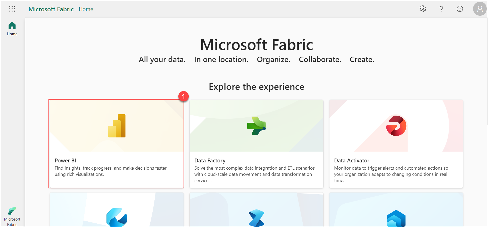
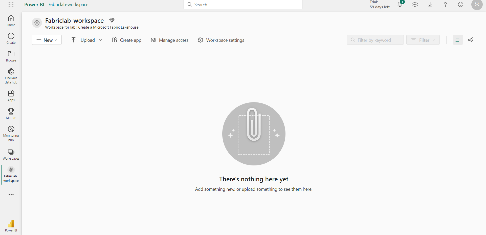
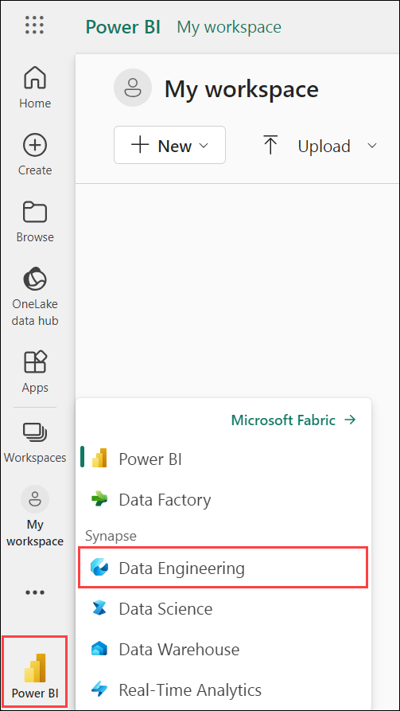
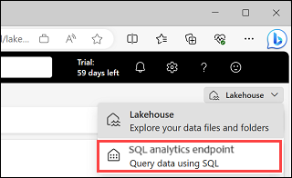
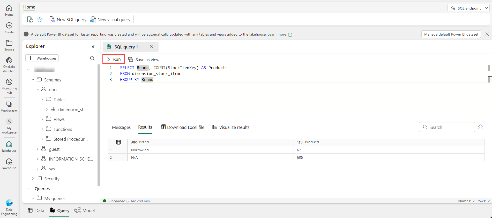
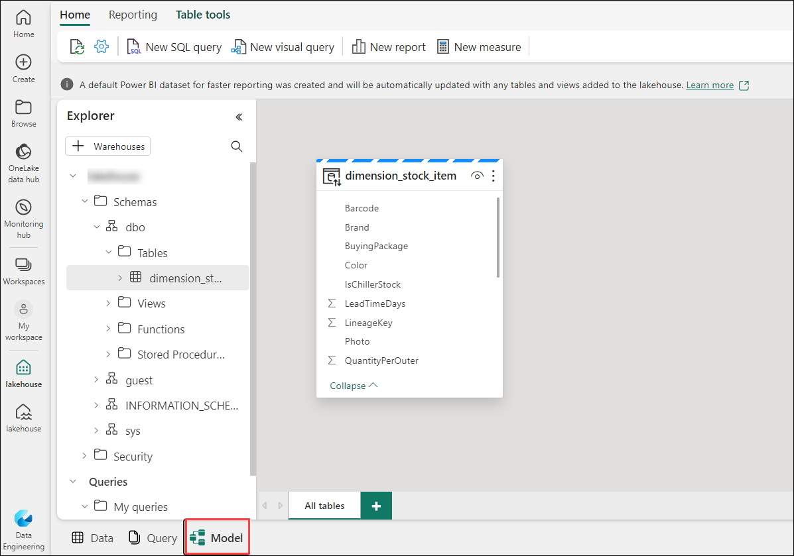
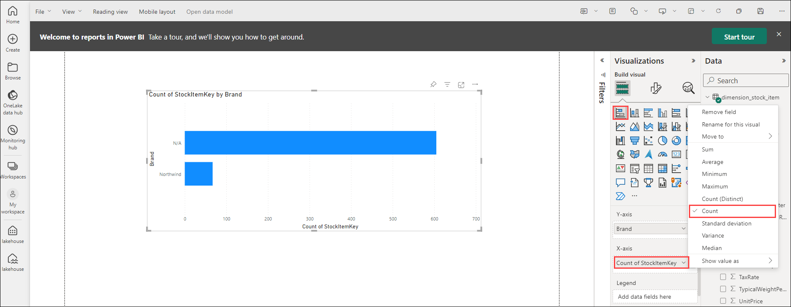

# Module 04b: Explore data analytics in Microsoft Fabric

## Lab scenario
In this exercise you'll explore data ingestion and analytics in a Microsoft Fabric Lakehouse.

## Lab Objectives

In this lab, you will perform:

+ Task 1: Create the workspace
+ Task 2: Create a lakehouse
+ Task 3: Ingest data
+ Task 4: Query data in a lakehouse
+ Task 5: Visualize data in a lakehouse

## Estimated Timing: 25 minutes

## Architecture diagram

   

## Task 1: Create the workspace

Before working with data in Fabric, create a workspace with the Fabric trial enabled.

1. On  **Microsoft Fabric** home page, select **Power BI**.

    

1. In the menu bar on the left, select Workspaces (the icon looks similar to 🗇). Select +New Workspace.
   
1. Create a new workspace with a name of your choice, select a licensing mode that includes Fabric capacity (Trial, Premium, or Fabric), and click on Apply.

1. When your new workspace opens, it should be empty.

   

## Task 2: Create a lakehouse

Now that you have a workspace, it's time to switch to the *Data engineering* experience in the portal and create a data lakehouse for your data files.

1. At the bottom left of the portal, select **PowerBI**, and switch to the **Data Engineering** experience.

   

    >**Note:** The data engineering home page includes tiles to create commonly used data engineering assets.

2. In the **Data engineering** home page, select **Lakehouse(Preview)**. On the **New Lakehouse** page, enter the name of your choice, and select **Create**.

   

3. View the new lakehouse, and note that the **Lakehouse explorer** pane on the left enables you to browse tables and files in the lakehouse:
    
    - The **Tables** folder contains tables that you can query using SQL. Tables in a Microsoft Fabric lakehouse are based on the open source *Delta Lake* file format, commonly used in Apache Spark.
    
    - The **Files** folder contains data files in the OneLake storage for the lakehouse that aren't associated with managed delta tables. You can also create *shortcuts* in this folder to reference data that is stored externally.
    
      >**Note:** Currently, there are no tables or files in the lakehouse.

    > **Congratulations** on completing the task! Now, it's time to validate it. Here are the steps:
    > - Click the Lab Validation tab located at the upper right corner of the lab guide section and navigate to the Lab Validation Page.
    > - Hit the Validate button for the corresponding task.
    > - If you receive a success message, you can proceed to the next task. If not, carefully read the error message and retry the step, following the instructions in the lab guide.
    > - If you need any assistance, please contact us at labs-support@spektrasystems.com. We are available 24/7 to help you out.


## Task 3: Ingest data

A simple way to ingest data is to use a **Copy Data** activity in a pipeline to extract the data from a source and copy it to a file in the lakehouse.

1. On the **Home** page for your lakehouse, select **Get data** drop-down, select **New data pipeline**, and create a new data pipeline named **Ingest Sales Data**.

1. In the **Copy Data into Lakehouse** wizard, on the **Choose a data source** page, select the **Retail Data Model from Wide World Importers**. Select **Next** and view the tables in the data source on the **Connect to data source** page..

   

1. Select the **dimension_stock_item** table, which contains records of products. Then select **Next** to progress to the **Choose data destination** page.

1. On the **Choose data destination** page, select your existing lakehouse. Then select **Next**.

1. Set the following data destination options, and then select **Next**:
    - **Root folder**: Tables
    - **Load settings**: Load to new table
    - **Destination table name**: dimension_stock_item
    - **Column mappings**: *Leave the default mappings as-it-is*
    - **Enable partition**: *Unselected*

1. On the **Review + save** page, ensure that the **Start data transfer immediately** option is selected, and then select **Save + Run**.

    A new pipeline containing a **Copy Data** activity is created, as shown here:

    

    >**Note:** When the pipeline starts to run, you can monitor its status in the **Output** pane under the pipeline designer. Use the **&#8635;** (*Refresh*) icon to refresh the status, and wait until it has succeeeded.

1. In the hub menu bar on the left, select your lakehouse.

1. On the **Home** page, in the **Lakehouse explorer** pane, expand **Tables** and verify that the **dimension_stock_item** table has been created.

    >**Note**: If the new table is listed as *unidentified*, use the **Refresh** button in the lakehouse toolbar to refresh the view.

## Task 4: Query data in a lakehouse

Now that you have ingested data into a table in the lakehouse, you can use SQL to query it.

1. At the top right of the Lakehouse page, switch to the **SQL endpoint** for your lakehouse.

    

1. In the toolbar, select **New SQL query**. Then enter the following SQL code into the query editor:

    ```sql
    SELECT Brand, COUNT(StockItemKey) AS Products
    FROM dimension_stock_item
    GROUP BY Brand
    ```

1. Select the **&#9655; Run** button to run the query and review the results, which should reveal that there are two brand values (*N/A* and *Northwind*) and show the number of products in each.

    

## Task 5: Visualize data in a lakehouse

Microsoft Fabric lakehouses organize all tables in a data model, which you can use to create visualizations and reports.

1. At the bottom left of the page, under the **Explorer** pane, select the **Model** tab to see the data model for the tables in the lakehouse (in this case there is only one table).

    

1. In the toolbar, select **New report** to open a new browser tab containing the Power BI report designer.

   >**Note:** If an **Action Required** page appears, select **Ask later**.

1. In the report designer:
    1. In the **Data** pane, expand the **dimension_stock_item** table and select the **Brand** and **StockItemKey** fields.
    
    1. In the **Visualizations** pane, select the **Stacked bar chart** visualization (it's the first one listed). Then ensure that the **Y-axis** contains the **Brand** field and change the aggregation in the **X-axis** to **Count** so that it contains the **Count of StockItemKey** field. Finally, resize the visualization in the report canvas to fill the available space.

        

    **Tip**: You can use the **>>** icons to hide the report designer panes in order to see the report more clearly.

1. On the **File** menu, select **Save** to save the report as **Brand Quantity Report** in your Fabric workspace.

    You can now close the browser tab contaning the report to return to your lakehouse. You can find the report in the page for your workspace in the Microsoft Fabric portal.

   > **Congratulations** on completing the task! Now, it's time to validate it. Here are the steps:
    > - Click the Lab Validation tab located at the upper right corner of the lab guide section and navigate to the Lab Validation Page.
    > - Hit the Validate button for the corresponding task.
    > - If you receive a success message, you can proceed to the next task. If not, carefully read the error message and retry the step, following the instructions in the lab guide.
    > - If you need any assistance, please contact us at labs-support@spektrasystems.com. We are available 24/7 to help you out.


1. Code Block Inject Key test

   ```
   Connect-AzAccount
   $securePassword = $password | convertto-securestring -AsPlainText -Force
   $UserCredential = New-Object -TypeName "System.Management.Automation.PSCredential" -ArgumentList $userName, <inject key="LabVM Admin Username" />
   Login-AzAccount -Credential <inject key="AzureAdUserEmail" />
   $context =  Select-AzSubscription -SubscriptionId jumpvm-<inject key="DeploymentID" />
   
   
   ```

## Review
In this lab, you have completed:
- Selected the workspace
- Created a lakehouse
- Ingested data
- Queried data in a lakehouse
- Visualized data in a lakehouse
  
## You have successfully completed this lab
