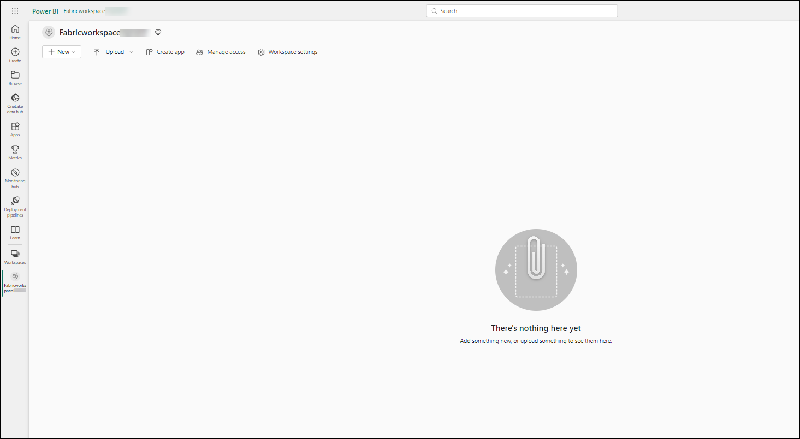
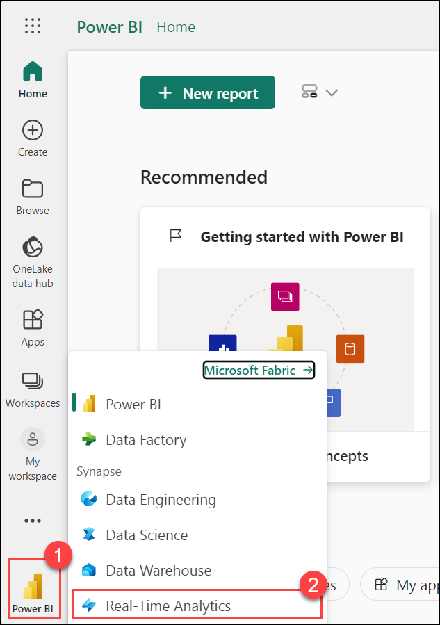
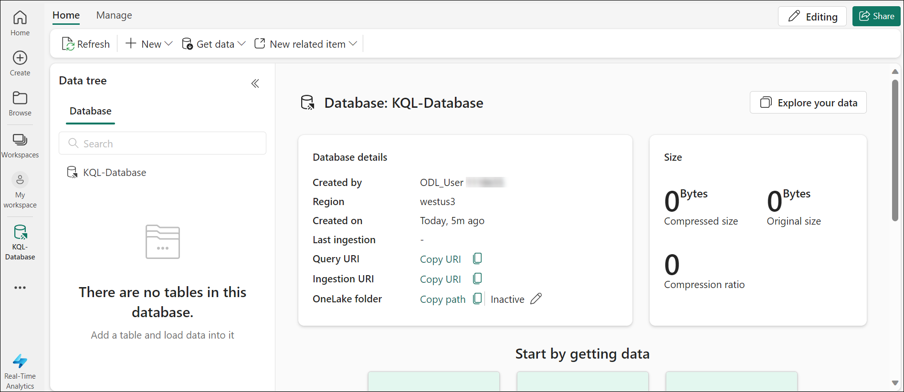
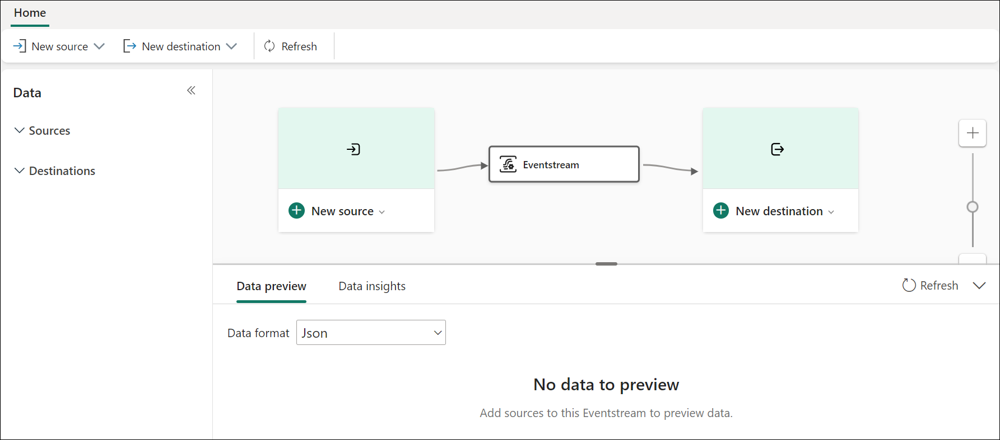
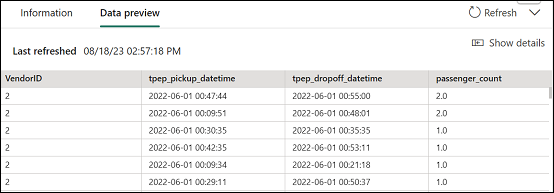
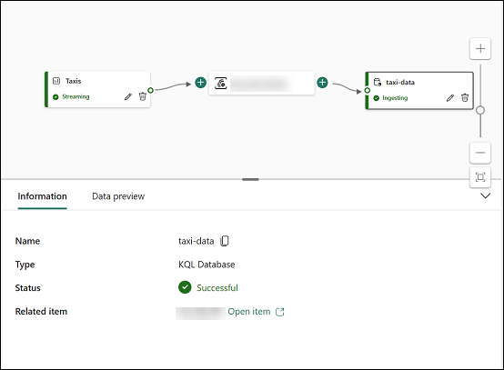
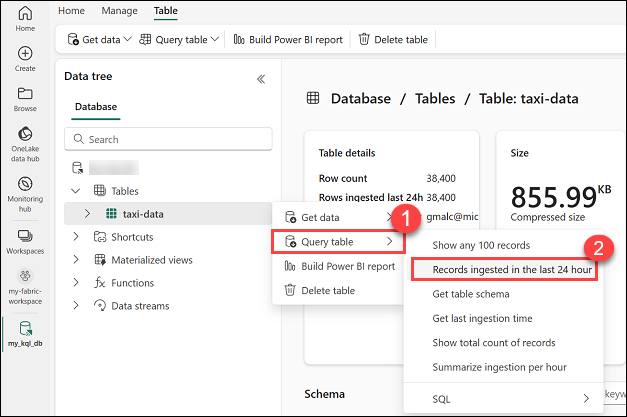

# Module 05c: Explore real-time analytics in Microsoft Fabric

## Lab scenario
In this lab you'll explore real-time analytics in Microsoft Fabric.

## Lab objective

In this lab, you will perform:

+ Task 1: Create the workspace
+ Task 2: Create a KQL database
+ Task 3: Create an eventstream
+ Task 4: Query real-time data in a KQL database

## Estimated timing: 25 minutes

## Architecture diagram


## Task 1: Create the workspace

Before working with data in Fabric, create a workspace with the Fabric trial enabled.

1. On  **Microsoft Fabric** home page, select **Power BI**.

    

1. In the menu bar on the left, select Workspaces (the icon looks similar to 🗇). Select +New Workspace.
   
1. Create a new workspace with a name **Fabricworkspace<inject key="DeploymentID" enableCopy="false"/>**.

1. When your new workspace opens, it should be empty.

   

    > **Congratulations** on completing the task! Now, it's time to validate it. Here are the steps:
    > - Click the Lab Validation tab located at the upper right corner of the lab guide section and navigate to the Lab Validation Page.
    > - Hit the Validate button for the corresponding task.
    > - If you receive a success message, you can proceed to the next task. If not, carefully read the error message and retry the step, following the instructions in the lab guide.
    > - If you need any assistance, please contact us at labs-support@spektrasystems.com. We are available 24/7 to help you out.

## Task 2: Create a KQL database

Now that you have a workspace, you can create a KQL database to store real-time data.

1. At the bottom left of the portal, switch to the **Real Time Analytics** experience.

    

    >**Note:** The real time analytics home page includes tiles to create commonly used assets for real-time data analyis

2. In the real time analytics home page, select **KQL Database (Preview)**, and create a new **KQL Database** with a name of your choice.

   >**Note:** If **Upgrade to a free Microsoft Fabric (preview) trial** pop-ups, select **Upgrade**.
   
   >**Note:**  on the **Successfully upgraded to a free Microsoft Fabric (preview) trial** page, select **OK**.

    After a minute or so, a new KQL database will be created:

    

    Currently, there are no tables in the database.

## Task 3: Create an eventstream

Eventstreams provide a scalable and flexible way to ingest real-time data from a streaming source.

1. In the menu bar on the left, select the **Home** page for the real-time analytics experience.

1. On the home page, select **Eventstream (Preview)**, and create a new **Eventstream** with a name of your choice.

    After a short time, the visual designer for your eventstream is displayed.

    

    The visual designer canvas shows a source that connects to your eventstream, which in turn is connected to a destination.

1. On the designer canvas, select the **New source** drop-down, select **Sample data**. Then in the **Sample data** pane, specify the following configurations,

   - Source name: **taxis** 
   - Sample data: **Yellow Taxi**
   - Select **Add**.

1. Beneath the designer canvas, select the **Data preview** tab to preview the data being streamed from the source:

    

1. On the designer canvas, select **New destination** drop-down, select **KQL database**. Then in the **KQL database** pane, specify the following configurations,
   
   - Destination name: **taxi-data**
   - Workspace: Select your workspace
   - KQL Database: Select your KQL database
   - Select **Create and configure**.

1. In the **Ingest data** wizard, on the **Destination** page, select **New table** and enter the table name **taxi-data**. Then select **Next: Source**.

1. On the **Source** page, review the default data connection name, and then select **Next: Schema**.

1. On the **Schema** page, change the **Data format** from TXT to **JSON**, and view the preview to verify that this format results in multiple columns of data. Then select **Next: Summary**.

1. On the **Summary** page, wait for continuous ingestion to be established, and then select **Close**.

1. Verify that your completed eventstream looks like this:

    

## Task 4: Query real-time data in a KQL database

Your eventstream continuously populates a table in your KQL database, enabling you to query the real-time data.

1. In the menu hub on the left, select your KQL database (or select your workspace and find your KQL database there).
1. Hover on **taxi-data** table, and select **...** menu, select **Query table > Records ingested in the last 24 hours**.

    

1. View the results of the query, which should be a KQL query like this:

    ```kql
    ['taxi-data']
    | where ingestion_time() between (now(-1d) .. now())
    ```

    The results show all taxi records ingested from the streaming source in the last 24 hours.

1. Replace all of the KQL query code in the top half of the query editor with the following code:

    ```kql
    // This query returns the number of taxi pickups per hour
    ['taxi-data']
    | summarize PickupCount = count() by bin(tpep_pickup_datetime, 1h)
    ```

1. Use the **&#9655; Run** button to run the query and review the results, which show the number of taxi pickups for each hour.

## Review
In this lab, you have completed:
- Created the workspace
- Created a KQL database
- Created an eventstream
- Queried real-time data in a KQL database
  
## You have successfully completed this lab
